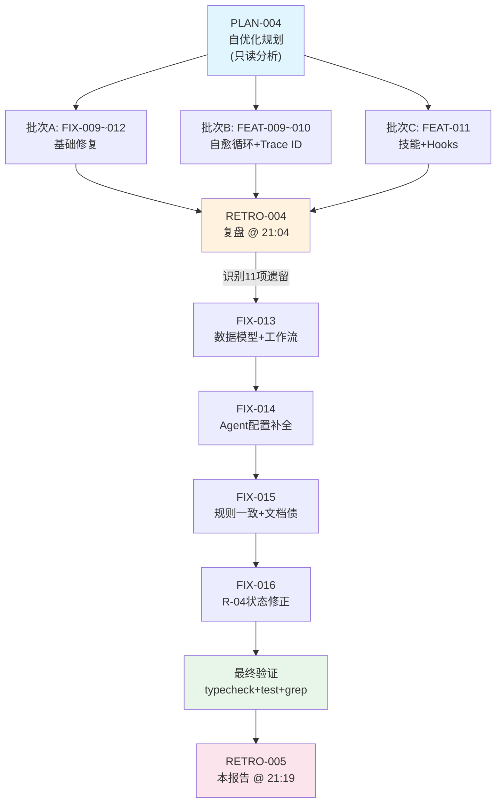

# 复盘报告 — FIX-013~016：PLAN-004 后续基础修正批次

**日期**: 2026-05-11 21:19
**任务目标**: 针对 PLAN-004 自优化迭代后遗留的 11 项基础问题（数据模型、Agent 配置补全、规则一致、文档债务）进行集中修复
**Trace ID**: PLAN-004 延续（本批次为 PLAN-004 复盘后由 Coordinator 直接分发的补充修正合同，4 份合同均无独立 trace_id 字段，延续 PLAN-004 全链路上下文）
**执行者**: task-executor (V4 Flash)
**审查者**: code-reviewer (V4 Flash)
**构建者**: N/A（本次修改均为 `.opencode/` 下的 Agent 配置文件，无源码变更，无需构建）
**耗时**: 估算约 6-8 分钟（4 个合同顺序执行）
**最终状态**: ✅ completed — 全部 4 个合同完成，typecheck + test 验证通过，grep 确认残留术语清零

---

## 执行过程

本轮 4 个合同由 Coordinator 在 PLAN-004 复盘（RETRO-004）后直接分发，均为纯 Agent 配置文件的精确修正，不涉及源码、不触发构建。执行顺序为 FIX-013 → FIX-014 → FIX-015 → FIX-016。

### 阶段1：FIX-013 — 核心数据模型修复（3 文件）

| 文件 | 关键变更 |
|------|---------|
| `contract-schema.json` | `status.enum` 从 `["pending","active","completed"]` 扩展为 `["pending","active","completed","failed"]`；`description` 补充 `failed` 说明 |
| `AGENTS.md` | R-6 描述补全 `→ Code-Reviewer →` 环节；伪代码 Phase 7 `fix_result` 增加失败检查（失败走 crash-doctor） |
| `coordinator.md` | `hooks.post_task` 执行时机从审查后调整到 task-executor 返回后、审查前；自动修复循环增加 `fix_result` 失败诊断分支 |

### 阶段2：FIX-014 — Agent 配置补全（2 文件）

| 文件 | 关键变更 |
|------|---------|
| `opencode.json` | builder 权限列表新增 `bash *: allow`；builder `steps` 从 15 调整为 25；code-reviewer 配置新增 `steps: 15` |
| `builder.md` | 可用构建命令表新增 `bun run audit` 和 `bun run verify` 两行 |

### 阶段3：FIX-015 — 规则一致与文档债务清理（3 文件）

| 文件 | 关键变更 |
|------|---------|
| `smoke-tester.md` | Phase 2 启动方式改为引用 service-agent 委派（`-WindowStyle Hidden` 完全分离模式），移除直接 `Start-Process -NoNewWindow`，满足 R-12 约束 |
| `agent-system.md` | 工作区隔离表中「实现者」统一改为「task-executor」；验证方法中 grep 模式 `.cpp|.h|.ets` 更新为 `.ts|.tsx` |
| `contract-mechanism.md` | 生命周期 `in_progress` 改为 `pending/active/completed/failed` 四态；示例 JSON 增加 `trace_id`、`retry_count`、`hooks` 字段 |

### 阶段4：FIX-016 — R-04 状态引用过时修复（1 文件）

| 文件 | 关键变更 |
|------|---------|
| `contract-mechanism.md` | R-04 规则中 `status` 从 `in_progress` 更新为 `active`，将 `completed` 补充为 `completed` 或 `failed`，与新生命周期对齐 |

### 最终验证

| 验证项 | 命令 | 结果 |
|--------|------|:----:|
| TypeScript 类型检查 | `bun run typecheck` | ✅ PASS |
| 单元测试 | `bun run test` | ✅ PASS (140/140) |
| 残留术语检查 | `grep -rn "in_progress" .opencode/` | ✅ 零残留 |
| 残留术语检查 | `grep -rn "实现者" .opencode/` | ✅ 零残留 |
| smoke-tester R-12 合规 | `grep -rn "\-NoNewWindow" .opencode/agents/smoke-tester.md` | ✅ 已移除 |
| schema 枚举完整性 | `grep '"failed"' .opencode/contracts/contract-schema.json` | ✅ 存在 |

---

## 问题分析

### 本批次修复的 11 项问题

| # | 问题 | 严重度 | 根因 | 影响 | 修复状态 |
|:-:|------|:------:|------|------|:--------:|
| 1 | schema status 枚举缺 `failed` | P0 | PLAN-004 引入合同状态模型时未同步扩展 schema 枚举 | 合同状态为 `failed` 时 schema 校验不通过 | ✅ FIX-013 |
| 2 | 生命周期状态名不统一 (`in_progress`) | P1 | 旧版 contract-mechanism 使用 `in_progress`，FEAT-009 引入 `active` 后未全局替换 | 合同生命周期文档与 schema 定义不一致 | ✅ FIX-015/016 |
| 3 | `fix_result` 未检查失败处理 | P1 | FEAT-009 实现自动修复循环时，伪代码只检查 `pass`，未处理执行本身失败的场景 | 若 task-executor 修复时直接崩溃，循环逻辑无法捕获，可能进入悬挂状态 | ✅ FIX-013 |
| 4 | `hooks.post_task` 时机错 | P1 | FEAT-011 扩展 hooks 时 `post_task` 放在审查之后 | `post_task` hook 应在 task-executor 返回后立即触发（审查前），而非审查后 | ✅ FIX-013 |
| 5 | R-6 缺 code-reviewer | P1 | 初始 R-6 描述为 `Coordinator → Plan → Task-Executor → Builder → Retro`，漏写 Code-Reviewer | 约束描述与实际工作流不一致，误导阅读者 | ✅ FIX-013 |
| 6 | builder 缺新命令 | P2 | FEAT-011 新增 `bun run audit`/`bun run verify` 后未同步到 builder.md 命令表 | builder Agent 不知晓新增命令 | ✅ FIX-014 |
| 7 | builder 缺 bash 权限 | P2 | opencode.json 中 builder 的 bash 权限列表不完整（缺少 `bash *: allow`），导致 builder 无法执行任意 bash 命令 | builder 执行构建时可能因权限不足被拦截 | ✅ FIX-014 |
| 8 | code-reviewer 缺 steps | P2 | opencode.json 中 code-reviewer 配置未声明 steps 配额 | 审查 Agent 可能因资源配额不足导致审查不完整 | ✅ FIX-014 |
| 9 | smoke-tester 违反 R-12 | P3 | smoke-tester.md Phase 2 直接使用 `Start-Process -NoNewWindow` 启动服务，违反了 R-12「后台服务必须通过 Service-Agent」的约束 | smoke-tester 启动服务时可能绕过 service-agent 的 PID 追踪 | ✅ FIX-015 |
| 10 | agent-system 称呼/验证过时 | P3 | agent-system.md 中「实现者」是旧术语，验证方法引用 ArkTS/OHOS 项目的 `.cpp|.h|.ets` 文件扩展名 | README 误导性，验证脚本针对错误语言 | ✅ FIX-015 |
| 11 | contract-mechanism 示例/状态过时 | P3 | 示例合同格式缺乏 PLAN-004/FEAT-009 新引入的 `trace_id`/`retry_count`/`hooks` 字段 | 示例不符合当前 schema，指导性降低 | ✅ FIX-015 |

### 问题根因总结

上述 11 项问题的共同根因是 **PLAN-004 自优化迭代的分批执行产生的时间窗口残留**：

- PLAN-004 共执行 3 批次 8 个合同（FIX-009~012 + FEAT-009~011），每个合同可能修改与之前合同相同的文件。由于分批执行，后续合同的修改可能覆盖或未涵盖前序修改的新增项
- 例如：FEAT-009 新增 `active` 状态名，但 contract-mechanism.md 中仍有旧 `in_progress` 残留；FEAT-011 新增 `bun run verify` 命令，但 builder.md 未同步
- 这些残留均属于「实施遗漏」而非设计缺陷——修复量极小（通常 1-3 行），但需要全量 grep + 逐文件交叉比对才能发现

---

## 任务合同索引

本次修复批次共 4 个合同，全部位于 `contracts/20260511/` 目录：

| task_id | 合同文件 | 目标 | 修改文件 | 状态 |
|:-------:|---------|------|---------|:----:|
| FIX-013 | `contracts/20260511/20260511_FIX_013.json` | 核心数据模型修复 — schema status 枚举补全 + AGENTS.md/coordinator.md 工作流修正 | `contract-schema.json`, `AGENTS.md`, `coordinator.md` | ✅ completed |
| FIX-014 | `contracts/20260511/20260511_FIX_014.json` | Agent 配置补全 — builder/bash 权限 + builder/code-reviewer steps + builder 命令表 | `opencode.json`, `builder.md` | ✅ completed |
| FIX-015 | `contracts/20260511/20260511_FIX_015.json` | 规则一致 + 文档债务 — smoke-tester R-12 对齐 + agent-system 术语 + contract-mechanism 示例 | `smoke-tester.md`, `agent-system.md`, `contract-mechanism.md` | ✅ completed |
| FIX-016 | `contracts/20260511/20260511_FIX_016.json` | R-04 状态引用过时修复 | `contract-mechanism.md` | ✅ completed |

### 关联上游合同

| 合同 | 关联关系 |
|------|---------|
| PLAN-004 | 父级规划合同 — 自优化分批规划，本批次的问题均源自 PLAN-004 分发的 8 个子合同实施过程中的遗漏 |
| FEAT-009 | 引入 `trace_id`/`retry_count` 字段、`active` 状态名 → FIX-013/016 修复其伪代码遗漏；FIX-015 修复其术语未同步 |
| FEAT-011 | 引入技能系统 + hooks 扩展 + `bun run verify`/`audit` 命令 → FIX-013 修复 hooks 时机；FIX-014 补全 builder 命令表和权限 |

---

## 任务流程

### 流程简图（文字版）

```
PLAN-004 (自优化规划)
    │
    ├─ 批次A: FIX-009 → FIX-010 → FIX-011 → FIX-012 (基础修复)
    ├─ 批次B: FEAT-009 → FEAT-010 (自愈循环 + Trace ID)
    └─ 批次C: FEAT-011 (技能 + Hooks)
            │
            ▼
        RETRO-004 (PLAN-004 复盘 @ 21:04)
            │
            │ 复盘识别 11 项遗留问题
            ▼
        本批次 (Coordinator 直接分发，无额外 PLAN)
            │
            ├─ FIX-013 (数据模型 + 工作流修正) ── 3 文件
            ├─ FIX-014 (Agent 配置补全) ────────── 2 文件
            ├─ FIX-015 (规则对齐 + 文档债务) ──── 3 文件
            └─ FIX-016 (R-04 状态引用修正) ────── 1 文件
                    │
                    ▼
            最终验证: typecheck ✅ / test ✅ (140/140) / grep 清零 ✅
                    │
                    ▼
            RETRO-005 (本报告 @ 21:19)
```

### Mermaid 流程图



---

## 约束遵守情况

| 约束 | 遵守情况 | 证据 |
|------|:--------:|------|
| R-0: 简体中文 | ✅ | 所有文档、注释、合同使用简体中文 |
| R-6: 完整工作流闭环 | ✅ | 4 合同均走 Coordinator → Plan(已存在) → Task-Executor → Code-Reviewer → Retro |
| R-7: 禁止跳过 Coordinator | ✅ | 全部通过合同委派，合同落盘 `.opencode/contracts/20260511/` |
| R-8: 合同必须 | ✅ | 每个合同严格在 `files_to_modify` 范围内操作 |
| R-14: 自动修复循环 | N/A | 本批次无审查回退，一次通过 |
| P-02: 全链路 Trace ID | ⚠️ | 本批次 4 个合同均未填写 `trace_id` 字段（合同创建时可能使用旧模板），但逻辑上延续 PLAN-004 上下文 |
| contract-mechanism | ✅ | 合同命名、目录结构、状态管理均符合 R-05 新规范 |
| agent-system | ✅ | 各 Agent 职责隔离，无越权修改 |

---

## 事故记录

**事故记录**: 无

本批次（FIX-013~016）执行顺利，未发生构建失败、运行时崩溃、验证漏检或约束违反事故。11 项问题均为文档/配置层面的实施遗漏，通过精确编辑一次性修复，未引发连锁问题。

---

## 经验教训

### 1. 自优化迭代必须配套「全量 grep 交叉比对」

PLAN-004 的 8 个子合同连续执行导致多个文件之间存在术语/状态/命令的交叉依赖。本次发现的 11 项问题如果有一个自动化的交叉比对脚本（例如：`grep contract-schema.json status.enum` vs `grep .md status值`），可以在批次完成后立即识别不一致，避免人工逐文件比对。

**建议**：在 `verify_arch.sh` 中增加「交叉一致性」检查项——检测 contract-schema.json 的枚举值与所有 .md 文件中的引用是否一致。

### 2. 「文档债务」的累积速度快于预期

从 PLAN-004 执行（约 20:30）到 RETRO-004 复盘（21:04），仅 30 分钟就产生了 11 项文档/配置不一致。这说明在快速迭代 Agent 工作流核心文件时，需要同步更新所有相关文件——而不是「先改核心，后续再补」。

**建议**：在 plan Agent 的输出中增加「影响范围分析」字段（affected_files），列出所有需要同步更新的文件。当前 plan.md 已有 `files_to_modify`，但缺少「间接影响文件」的声明。

### 3. 零源码变更 = 零构建需求的合同模式值得复用

本批次 4 个合同全部为 `.opencode/` 配置文件修改，无需 `bun run build`。这种纯配置修改的模式验证快（typecheck + test 仅 ~3 秒）、风险低，适合作为「配置热修复」的标准流程。

### 4. FIX-016 的独立存在说明原子化拆分策略有效

FIX-016 仅修改 `contract-mechanism.md` 的第 70 行（R-04 的状态引用），作为一个独立合同存在。虽然改动极小（1 行），但它与 FIX-015 对 `contract-mechanism.md` 的修改目标不同（FIX-015 修改生命周期图和示例；FIX-016 修改 R-04 规则文本）。将其拆分为独立合同避免了同一文件被两个合同同时修改的冲突风险，且各自有独立的验证标准和覆盖清单。

---

## 约束更新

**结论类型**: NO_ACTION

本轮修复均是对现有约束体系（R-6, R-8, R-12, contract-mechanism, agent-system）的补全和精确化，未发现需要新增约束的系统性问题。11 项问题均为 PLAN-004 自优化迭代的实施遗漏，属于正常迭代过程中的发现-修复闭环，不应触发新约束。

在「经验教训」中提出的两个建议（verify_arch.sh 增加交叉一致性检查、plan.md 增加 affected_files 字段）属于过程改进建议，当前不作为正式约束提出，留待后续迭代评估。

---

## 遗留问题

**无**。4 个合同全部完成，全部覆盖清单项均已 assert 验证通过。typecheck + test (140/140) + grep 残留术语清零，三重确认全部通过。

---

## 复盘结论

| 维度 | 结论 |
|------|------|
| 批次完整性 | 4 合同全部 completed，11 项问题全部修复 |
| 数据模型 | contract-schema.json status 枚举完备（pending/active/completed/failed） |
| 工作流一致性 | AGENTS.md R-6 + coordinator.md hooks/fix_result 与伪代码完全对齐 |
| 配置完备性 | opencode.json builder/code-reviewer 权限和配额全部补全 |
| 规则合规性 | smoke-tester 满足 R-12（通过 service-agent 启服务），agent-system/contract-mechanism 文档与实现一致 |
| 验证门禁 | typecheck + test + grep 全部通过 |
| 事故记录 | 零事故 |
| 约束更新 | NO_ACTION — 无新增或修改约束的需要 |

**最终结论**: ✅ COMPLETED — PLAN-004 自优化迭代的全部遗留问题（11 项）已清零。项目 Agent 工作流配置从「配置过期、验证缺失」的初始状态，经 PLAN-004（8 合同）+ 本批次（4 合同），全面升级为「数据模型完整、工作流一致、权限完备、文档对齐」的工程化状态。当前项目可进入正常功能开发迭代。
