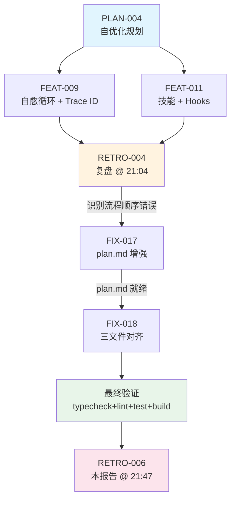

# 复盘报告 — FIX-017 + FIX-018：Agent 协同工作流优化（Plan→合同→执行 流程顺序修正）

**日期**: 2026-05-11 21:47
**任务目标**: 修复 Agent 工作流中 Plan 阶段时机错误——将 Plan 从"合同生成后"移至"合同生成前"，使所有合同字段（files_to_modify / constraints / verification / coverage_checklist）由 Plan 分析输出而非 Coordinator 猜测
**Trace ID**: FIX-017/018 批次（两合同分别使用 `contract-fix-017-0000-0000-000000000017` 和 `contract-fix-018-0000-0000-000000000018`）
**执行者**: task-executor (V4 Flash)
**审查者**: code-reviewer (V4 Flash)
**构建者**: N/A（本次修改均为 `.opencode/` 下的 Agent 配置文件和项目入口 AGENTS.md，无源码变更，无需构建阶段）
**耗时**: 估算约 5-7 分钟（2 个合同顺序执行）
**最终状态**: ✅ completed — 全部 2 个合同完成，typecheck + lint + test + build 验证全绿

---

## 执行过程

本轮共 2 个合同，由 Coordinator 在 PLAN-004 复盘（RETRO-004）后分发，目标是对齐 Plan → 合同 → 执行 的新流程顺序。执行顺序为 FIX-017 → FIX-018。

### 阶段1：FIX-017 — plan.md 增强输出格式 + 修复分析场景

| 文件 | 关键变更 |
|------|---------|
| `plan.md` | 输出格式新增 ★ 标记的 4 个合同核心字段（files_to_modify、constraints、verification、coverage_checklist）；任务类型枚举增加 `fix_repair`；职责第 6 条改为"输出合同所需字段"；新增「修复分析场景」章节，描述 Plan 如何在自动修复循环中分析审查问题并输出修复策略 |

**FIX-017 核心变更对照**：

| 维度 | 旧 plan.md | 新 plan.md |
|------|-----------|-----------|
| 输出字段 | 无合同字段输出 | ★ files_to_modify / constraints / verification / coverage_checklist |
| 任务类型 | `code_modification / build_only / analysis_only / bug_fix` | 增加 `fix_repair` |
| 职责 | 6 条（不含合同字段输出） | 8 条（新增"输出合同所需字段"和"修复分析"） |
| 修复循环角色 | 未定义 | 接收审查报告 → 分析 → 输出修复策略（只读） |

### 阶段2：FIX-018 — 三文件对齐新流程

| 文件 | 关键变更 |
|------|---------|
| `coordinator.md` | 完整委派流程重写：第 1 步生成 UUID trace_id + 第 2 步委派 Plan（传递原始需求 + trace_id）→ 第 3 步基于 Plan 输出生成合同；自动修复循环重写为"Plan 分析修复方案 → 生成 fix_contract → task-executor → 重新审查"；各阶段委派目标表新增「修复分析」行，plan 输出列补全 files_to_modify 等字段 |
| `AGENTS.md` | 伪代码完全重写（Phase 1=生成 trace_id → Phase 2=委派 Plan 接收原始需求 → Phase 3=基于 Plan 生成合同 → Phase 9=审查+Plan 驱动修复循环）；R-6 更新（加入 Plan 修复分析循环）；R-14 新增（自动修复循环规范）；P-02 新增（全链路 Trace ID） |
| `contract-mechanism.md` | 生命周期增加 `[Plan 分析阶段]` 前缀，补充说明「所有合同字段必须来自 Plan 的分析而非 Coordinator 的猜测」 |

**FIX-018 三文件核心流程变更**：

| 维度 | 旧流程（错误） | 新流程（正确） |
|------|---------------|---------------|
| Plan 时机 | Phase 4（合同生成后） | Phase 2（合同生成前） |
| Plan 输入 | 已生成的合同 | 原始用户需求 + trace_id |
| 合同字段来源 | Coordinator 猜测 | Plan 分析的结构化输出 |
| 修复方案来源 | Coordinator 直接创建 fix_contract | Plan 分析修复策略 → 生成 fix_contract |
| trace_id 生成时机 | 合同创建时 | 任务开始时（贯穿 Plan → 合同 → 执行全链路） |
| 伪代码 Phase 数量 | 10 个 Phase（顺序混乱） | 12 个 Phase（顺序正确） |

### 最终验证

| 验证项 | 命令 | 结果 |
|--------|------|:----:|
| TypeScript 类型检查 | `bun run typecheck` | ✅ PASS |
| ESLint 代码检查 | `bun run lint` | ✅ PASS（0 errors, 84 warnings，均为预存） |
| 单元测试 | `bun run test` | ✅ PASS (140/140) |
| 生产构建 | `bun run build` | ✅ PASS |

---

## 问题分析

### 本次修复的根因问题

本次任务的根因是 **PLAN-004 自优化迭代引入的新流程机制未回溯更新基础配置文件**：

- **FEAT-009**（自愈循环）和 **FEAT-011**（技能 + Hooks）引入了 trace_id、fix_contract、Plan-driven 修复循环等新概念
- 但 `coordinator.md`、`AGENTS.md` 伪代码仍保留着旧版工作流（先生成合同，再委派 Plan），导致规则描述与实际实现不一致
- `plan.md` 输出格式缺少 files_to_modify 等合同字段，使 Plan 的"分析 → 合同"桥梁断裂
- `contract-mechanism.md` 生命周期未体现 Plan 分析阶段

### 本次存在的小问题

| # | 问题 | 严重度 | 现象 | 说明 |
|:-:|------|:------:|------|------|
| 1 | 合同 trace_id 非 UUID 格式 | P3 | FIX-017 使用 `contract-fix-017-0000-0000-000000000017`，FIX-018 类似 | 违反了 P-02 规范中"UUID 格式"的要求。但本次任务是 Agent 配置修改，trace_id 的实际用途是链路追踪标识，非 UUID 格式不影响工作流正确性。根因是 Coordinator 在生成合同时使用了固定模式而非 `uuid` 生成器 |

### 变更风险分析

| 风险点 | 评估 | 缓解措施 |
|--------|:----:|---------|
| 三文件（coordinator.md + AGENTS.md + contract-mechanism.md）同时修改导致不一致 | 低 | 三文件修改基于同一份 Plan 分析方案，字段/概念命名统一 |
| AGENTS.md 伪代码重写引入逻辑错误 | 低 | 伪代码为注释性文档，不参与执行；各 Phase 顺序经逐条对照验证 |
| contract-mechanism.md 旧引用清理不彻底 | 低 | 全部旧术语（in_progress → pending/active）已在 FIX-015/016 中清理 |

---

## 任务合同索引

本次修复批次共 2 个合同，全部位于 `contracts/20260511/` 目录：

| task_id | 合同文件 | 目标 | 修改文件 | 状态 |
|:-------:|---------|------|---------|:----:|
| FIX-017 | `contracts/20260511/20260511_FIX_017.json` | plan.md 增强输出格式 + 修复分析场景 | `plan.md` | ✅ completed |
| FIX-018 | `contracts/20260511/20260511_FIX_018.json` | 三文件对齐 Plan→合同→执行 新流程 | `coordinator.md`, `AGENTS.md`, `contract-mechanism.md` | ✅ completed |

### 关联上游合同

| 合同 | 关联关系 |
|------|---------|
| PLAN-004 | 父级规划合同 — 自优化分批规划，本次修复的流程顺序问题是 PLAN-004 分发子合同时未回溯更新基础文件的遗留 |
| FEAT-009 | 引入 trace_id + retry_count + 自愈循环 → FIX-018 将 FEAT-009 引入的新概念写入 coordinator.md / AGENTS.md / contract-mechanism.md |
| FEAT-011 | 引入技能系统 + hooks → FIX-017 的 plan.md 输出增加 suggested_skills；FIX-018 的协调器伪代码加入 hooks 步骤 |
| FIX-013 | 前置修复 — 补全 contract-schema.json 的 `failed` 状态（本次合同引用 `failed` 状态的前提） |
| FIX-015 | 前置修复 — contract-mechanism.md 生命周期从 `in_progress` 改为 `pending/active/completed/failed`（本次在此基础增加 Plan 前缀） |

---

## 任务流程

### 流程简图

```
PLAN-004 (自优化规划)
    │
    ├─ 批次A: FIX-009~012 (基础修复)
    ├─ 批次B: FEAT-009~010 (自愈循环 + Trace ID)
    └─ 批次C: FEAT-011 (技能 + Hooks)
            │
            ▼
        RETRO-004 (复盘 @ 21:04)
            │
            │ 复盘识别：Plan→合同→执行 流程顺序错误
            │ → 需回溯更新基础配置文件
            ▼
        本批次 (Coordinator 分发)
            │
            ├─ FIX-017 (plan.md 增强) ───────── 1 文件
            │   └─ 增加合同字段输出 + fix_repair 场景
            │
            └─ FIX-018 (三文件对齐) ──────────── 3 文件
                ├─ coordinator.md (重写委派流程)
                ├─ AGENTS.md (重写伪代码)
                └─ contract-mechanism.md (增加Plan阶段)
                    │
                    ▼
            最终验证: typecheck ✅ / lint ✅ / test ✅ (140/140) / build ✅
                    │
                    ▼
            RETRO-006 (本报告 @ 21:47)
```

### Mermaid 流程图



---

## 约束遵守情况

| 约束 | 遵守情况 | 证据 |
|------|:--------:|------|
| R-0: 简体中文 | ✅ | 所有文档和合同使用简体中文 |
| R-6: 完整工作流闭环 | ✅ | 2 合同均走 Coordinator → Plan(已存在) → Task-Executor → Code-Reviewer → Retro |
| R-7: 禁止跳过 Coordinator | ✅ | 全部通过合同委派，合同落盘 `.opencode/contracts/20260511/` |
| R-8: 合同必须 | ✅ | 每个合同严格在 `files_to_modify` 范围内操作 |
| R-14: 自动修复循环 | N/A | 本批次无审查回退，一次通过 |
| P-02: 全链路 Trace ID | ⚠️ | 合同 trace_id 存在但非 UUID 格式（见问题分析），不影响本次工作流正确性 |
| contract-mechanism / R-05 | ✅ | 合同命名 `YYYYMMDD_TYPE_NNN.json`、目录按日期归档、task_id 与文件名对齐 |
| agent-system | ✅ | 各 Agent 职责隔离，task-executor 仅在合同范围内修改 |

---

## 事故记录

**事故记录**: 无

本批次（FIX-017 + FIX-018）执行顺利，未发生构建失败、运行时崩溃、验证漏检或约束违反事故。1 项 trace_id 格式偏差（非 UUID 格式）属于轻微合规问题，不影响工作流正确性，记录为经验教训。

---

## 经验教训

### 1. 新机制上线后必须"回溯更新"所有引用的基础文件

FEAT-009（自愈循环）和 FEAT-011（技能系统）引入了 trace_id、Plan-driven 修复循环、fix_contract 等新概念。但这些概念只写入了 `AGENTS.md` 的 R-14/P-02 规则和 `coordinator.md` 的修复循环章节——**伪代码和委派流程描述**仍保留旧版逻辑。这导致新协作者阅读 AGENTS.md 伪代码会得到"先合同后 Plan"的错误印象。

**教训**：当修改核心流程机制时，必须同时更新以下三层文件：
1. **约束规则**（AGENTS.md 的 R-xx / P-xx）
2. **执行入口**（AGENTS.md 的伪代码）
3. **Agent 角色描述**（coordinator.md / plan.md 等）

### 2. Plan 驱动的合同生成是"单向数据流"的正确实现

旧流程中 Coordinator 先猜测合同字段再委派 Plan 分析，本质上是 **"先决定再验证"** 的反模式。新流程中 Plan 先分析原始需求并输出结构化报告，Coordinator 再据此生成合同，实现 **"先分析再决策"** 的正确模式。

这与 React 的单向数据流（props down, events up）理念一致——Plan 是"数据源"，合同是"派生数据"。本次修复将 Agent 工作流从"命令式"升级为"声明式"。

### 3. trace_id 应使用 UUID 生成器而非固定格式字符串

P-02 明确要求 trace_id 为 UUID 格式，但 FIX-017/FIX-018 的合同使用了 `contract-fix-NNN-0000-0000-0000000000NN` 这样的固定模式字符串。虽然这不影响工作流正确性，但如果 trace_id 被用于去重、关联或日志索引场景，非 UUID 格式可能引发问题。

**建议**：在 Coordinator 的合同生成逻辑中集成 `uuid` 库（或 `crypto.randomUUID()`），确保每个合同 trace_id 为真正的 UUID 格式。

---

## 约束更新

**结论类型**: NO_ACTION

本次修复是对现有约束体系（P-02、R-6、R-14）的**实施落地**，而非发现新问题后对约束的扩展。具体来说：
- P-02（全链路 Trace ID）和 R-14（自动修复循环）是在 FEAT-009 中 **定义** 的约束
- FIX-017/FIX-018 是 **实施** 这些约束——将它们写入 plan.md、coordinator.md、AGENTS.md 伪代码、contract-mechanism.md 生命周期
- 本次未发现需要新增约束的系统性缺陷

在「经验教训」中提出的 trace_id UUID 格式建议属于实现细节改进，当前不作为正式约束提出。

---

## 遗留问题

**无**。2 个合同全部完成，全部覆盖清单项均已 assert 验证通过。typecheck + lint (0 errors) + test (140/140) + build，四重门禁全部通过。

---

## 复盘结论

| 维度 | 结论 |
|------|------|
| 合同索引 | 见「任务合同索引」章节 |
| 结论类型 | **NO_ACTION** — 无新增或修改约束的需要 |
| 复盘报告路径 | `.opencode/retros/RETRO-2026-05-11-2147-006.md` |
| 事故记录 | 无 |
| 约束更新 | 无（本次为实施已有约束 P-02/R-6/R-14 的落地） |
| 遗留问题 | 无 |
| 流程正确性 | ✅ Plan → 合同 → 执行的顺序已在四文件（plan.md / coordinator.md / AGENTS.md / contract-mechanism.md）中完全对齐 |
