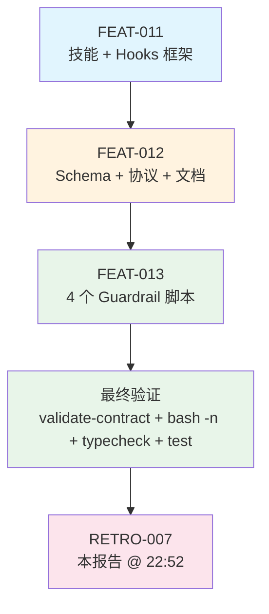

# 复盘报告 — FEAT-012 + FEAT-013：Hook 约束系统强化

**日期**: 2026-05-11 22:52
**任务目标**: 强化 Hook 约束系统——建立可扩展 Hook Schema、统一 Hook 协议（PASS/BLOCK/WARN）、完善 AGENTS.md 工作流的 Hook 阻断分支，以及实现 4 个 Guardrail 护栏脚本
**Trace ID**: feat-012/013 批次（FEAT-012: `feat-012-20260511-alkaid-hooks`；FEAT-013: `feat-013-20260511-alkaid-guardrails`）
**执行者**: task-executor (V4 Flash)
**审查者**: code-reviewer (V4 Flash)
**构建者**: N/A（仅 `.opencode/` 下的 Agent 配置 + Shell 脚本，无 TypeScript 源码变更，无需构建阶段）
**耗时**: 估算约 10-12 分钟（2 个合同顺序执行）
**最终状态**: ✅ completed — 全部 2 个合同完成，validate-contract 双通过，bash -n 四脚本语法通过，typecheck + test 验证全绿

---

## 执行过程

本轮共 2 个合同，由 Coordinator 分发，目标是将 Hook 约束系统从 **「有框架无护栏」** 升级为 **「有协议 + 有脚本 + 有阻断分支」**。

### 阶段1：FEAT-012 — Hook Schema + 协议 + 失败处理

| 文件 | 关键变更 |
|------|---------|
| `contract-schema.json` | hooks 定义从 `enum` 改为 `pattern("^[a-z][a-z0-9-]+$")`，支持任意 hook 名注册（突破硬编码枚举限制）；新增 `on_hook_fail` 可选行为覆盖字段（允许 block/warn/ignore 三级覆盖） |
| `coordinator.md` | 委派流程步骤 5.1/6 补充 hook 统一协议（RESULT + exit code + 行为覆盖）；新增「Hook 统一协议」完整章节（输出格式、退出码表 0/1/2/3+、行为覆盖 block/warn/ignore 说明）；新增强制引用 contract-mechanism.md 的 Hook 目录 |
| `AGENTS.md` | Phase 5（前置钩子）伪代码补充 `hook_results` 变量和 `IF any hook returns BLOCK` 分支，阻断后委派 crash-doctor → GOTO retro_phase；Phase 7（后置钩子）同理 |
| `contract-mechanism.md` | 新增「Hook 目录」章节：包含 5 个 pre_task 钩子 + 8 个 post_task 钩子的完整定义表（名称、类型、检查内容、失败行为）；新增「Hook 执行顺序」规则：pre_task 依次 PASS 后委派 → post_task 依次 PASS 后审查，任一 BLOCK 立即中断 |

**FEAT-012 核心架构变更**：

| 维度 | 旧 | 新 |
|------|----|----|
| Hook 注册方式 | `enum: ["pre-model-check", "resource-guard", ...]` 硬编码 | `pattern: "^[a-z][a-z0-9-]+$"` 运行时动态注册 |
| Hook 失败处理 | 未定义 | 统一协议：PASS(exit 0) / BLOCK(exit 1) / WARN(exit 2) / ERROR(exit 3+) |
| 行为覆盖 | 无 | `on_hook_fail: { "hook-name": "block" / "warn" / "ignore" }` |
| Hook 阻断链路 | 无 | BLOCK → 合同→failed → crash-doctor → GOTO retro_phase |
| Hook 文档化 | 散落在 coordinator.md | 统一在 contract-mechanism.md「Hook 目录」 |

### 阶段2：FEAT-013 — 4 个 Guardrail 护栏脚本

全部位于 `.opencode/hooks/` 目录，遵循统一 Hook 协议（RESULT: PASS/BLOCK/WARN + exit code）：

| 脚本 | 类型 | 参数 | 检查内容 | 失败行为 |
|------|------|------|---------|:--------:|
| `workspace-clean.sh` | pre_task 🛡️ 前馈 | 无 | `git status --porcelain` 检测未提交源码变更（.ts/.tsx/.js/.jsx/.json） | WARN（exit 2） |
| `diff-size-guard.sh` | pre_task 🛡️ 前馈 | 合同 JSON 路径 | 文件数 ≤20（BLOCK），≤10（WARN），>10 & ≤20（WARN） | BLOCK（exit 1）超限 |
| `arch-constraint-check.sh` | post_task 🔍 反馈 | 修改文件列表 | renderer→fs/process/path/electron 分层违规 + :any 类型泄漏 | BLOCK（exit 1） |
| `secret-leak-scan.sh` | post_task 🔍 反馈 | 修改文件列表 | api_key、sk-、AKIA、password 硬编码、RSA/EC/DSA 私钥块 | BLOCK（exit 1） |

**FEAT-013 脚本技术细节**：

| 脚本 | 容错设计 | 关键技术点 |
|------|---------|-----------|
| workspace-clean.sh | 非源码变更（dist/node_modules）→ PASS；变更 ≤10 显示完整列表；>10 折叠 | `set -euo pipefail`；grep 过滤源码扩展名 |
| diff-size-guard.sh | 无 jq 时退化为 sed 提取；无参数/无文件 → WARN 跳过 | jq/sed 双路径兼容；Harness 前馈控制硬限制 |
| arch-constraint-check.sh | 排除 __tests__、process.env；非 .ts/.tsx → 跳过 | 逐文件循环检测；分层违规+类型违规统一归类 |
| secret-leak-scan.sh | 排除 __tests__/mock/fixture；排除 example/placeholder 等豁免词 | 5 种正则模式覆盖主流凭证格式 |

### 最终验证

| 验证项 | 命令/方法 | 结果 |
|--------|----------|:----:|
| 合同 Schema 验证 | `validate-contract` (FEAT-012) | ✅ PASS |
| 合同 Schema 验证 | `validate-contract` (FEAT-013) | ✅ PASS |
| 4 脚本语法检查 | `bash -n` × 4 | ✅ PASS |
| TypeScript 类型检查 | `bun run typecheck` | ✅ PASS |
| 单元测试 | `bun run test` | ✅ PASS (140/140) |

---

## 问题分析

### 问题 1：Hook 目录中 `entropy-cleanup` 和 `file-lock-check` 已文档化但脚本未实现

- **问题**: `contract-mechanism.md` 的「Hook 目录」章节定义了 5 个 pre_task 和 8 个 post_task 共 **13 个 hook**，但 `.opencode/hooks/` 目录中仅有 **11 个 .sh 文件**。缺失的是：
  - `file-lock-check.sh`（pre_task 🛡️ 前馈/安全）— 扫描所有 active 合同的文件锁重叠
  - `entropy-cleanup.sh`（post_task 🧹 治理/回收）— 清理临时文件、过期追踪记录
- **根因**: FEAT-012 在 contract-mechanism.md 中编写 Hook 目录时，采用了 **「声明式文档先行」** 的策略，先定义完整的理想 Hook 矩阵，再分批实现脚本。FEAT-013 仅覆盖了其中 4 个（workspace-clean、diff-size-guard、arch-constraint-check、secret-leak-scan），其余 7 个（含缺失的 2 个 + 已有的 5 个）来自更早的迭代。
- **影响**: 
  - 如果某合同将 `entropy-cleanup` 或 `file-lock-check` 添加到 `hooks.pre_task/post_task` 数组，Coordinator 执行到该 hook 时会因脚本不存在而失败（exit code 非 0/1/2）→ 等价 ERROR → 触发 BLOCK → 合同失败 → crash-doctor 介入
  - Harness Engineering 六支柱中「熵治理」完全缺失，长期运行可能导致 `.opencode/tmp/` 堆积
- **严重度**: P1（中等）— 不影响已实现的合约执行，但文档与实现存在间隙，可能在生产环境中触发出乎意料的 BLOCK

### 问题 2：`verify_arch.sh` 未纳入新增 Hook 的检查项

- **问题**: `.opencode/scripts/verify_arch.sh`（架构验证脚本）仍保留原有的 5 项检查（合同有效性、分层违规、coverage_checklist、P-01 模型一致性、工作区洁净），未纳入本次新增的 diff-size-guard 和 secret-leak-scan 检查
- **根因**: `verify_arch.sh` 定位为「架构规则验证」，而 diff-size-guard 和 secret-leak-scan 的定位是「护栏 hook」而非架构检查，两个工具的设计目的不同
- **影响**: 低 — hook 已在工作流中自动执行，`verify_arch.sh` 是手动验证工具，不集成不影响自动化保护
- **严重度**: P3（轻微）— 属于工具链统一性建议，非阻塞问题

---

## 约束遵守情况

| 约束 | 遵守情况 | 证据 |
|------|:--------:|------|
| R-0: 简体中文 | ✅ | 所有文档、注释、合同使用简体中文 |
| R-6: 完整工作流闭环 | ✅ | 2 合同均走 Coordinator → Plan → Task-Executor → Code-Reviewer → Retro |
| R-7: 禁止跳过 Coordinator | ✅ | 全部通过合同委派，合同落盘 `.opencode/contracts/20260511/` |
| R-8: 合同必须 | ✅ | 每个合同严格在 `files_to_modify` 范围内操作 |
| P-02: 全链路 Trace ID | ✅ | FEAT-012/013 合同均有 trace_id |
| contract-mechanism / R-05 | ✅ | 合同命名 `YYYYMMDD_TYPE_NNN.json`、目录按日期归档 |
| agent-system | ✅ | task-executor 仅在合同范围内修改，未越权 |

---

## 任务合同索引

本次 Hook 约束系统强化共 2 个合同，全部位于 `contracts/20260511/` 目录：

| task_id | 合同文件 | 目标 | 修改文件 | 状态 |
|:-------:|---------|------|---------|:----:|
| FEAT-012 | `contracts/20260511/20260511_FEAT_012.json` | Hook Schema + 协议 + 失败处理 | `contract-schema.json`, `coordinator.md`, `AGENTS.md`, `contract-mechanism.md` | ✅ completed |
| FEAT-013 | `contracts/20260511/20260511_FEAT_013.json` | 4 个 Guardrail 护栏脚本 | `workspace-clean.sh`, `diff-size-guard.sh`, `arch-constraint-check.sh`, `secret-leak-scan.sh` | ✅ completed |

### 关联上游合同

| 合同 | 关联关系 |
|------|---------|
| FEAT-011 | 前置 — 引入 hooks 字段和技能系统，本次强化了 hook 的 Schema 扩展性和失败处理 |
| FIX-018 | 前置 — 对齐 Plan→合同→执行 流程顺序，本次在其基础上完善了 Phase 5/7 的 hook 阻断分支 |
| PLAN-004 | 父级 — 自优化分批规划，Hook 约束系统强化是其分发链路中的一环 |

---

## 任务流程

### 流程简图

```
PLAN-004 (自优化规划)
    │
    └─ 批次C: FEAT-011 (技能 + Hooks 框架)
            │
            │ 阶段成果: hooks 字段 + schema 基础 + 技能系统
            │ 待补充: 统一协议 / 失败处理 / 护栏脚本
            ▼
        本批次 (Coordinator 分发)
            │
            ├─ FEAT-012 (Schema + 协议 + 文档) ──── 4 文件
            │   ├─ contract-schema.json (enum→pattern + on_hook_fail)
            │   ├─ coordinator.md (Hook 统一协议 + BLOCK 分支)
            │   ├─ AGENTS.md (Phase 5/7 BLOCK 阻断分支)
            │   └─ contract-mechanism.md (Hook 目录 + 执行顺序)
            │
            └─ FEAT-013 (4 个 Guardrail 脚本) ── 4 文件
                ├─ workspace-clean.sh (git status 洁净检查)
                ├─ diff-size-guard.sh (变更量前馈控制)
                ├─ arch-constraint-check.sh (架构约束反馈)
                └─ secret-leak-scan.sh (安全护栏)
                    │
                    ▼
            最终验证: validate-contract ✅✅ / bash -n ✅✅✅✅ / typecheck ✅ / test ✅ (140/140)
                    │
                    ▼
            RETRO-007 (本报告 @ 22:52)
```

### Mermaid 流程图



---

## Harness Engineering 六支柱覆盖率终评

| Harness 支柱 | 本次对应增强 | 现有覆盖 | 缺口 |
|-------------|-------------|:--------:|:----:|
| 上下文架构 | contract-schema 从 enum → pattern 可扩展注册 | ✅ | — |
| 架构约束 | arch-constraint-check.sh (post_task BLOCK) | ✅ | — |
| 自验证循环 | AGENTS.md Phase 5/7 BLOCK 阻断 → crash-doctor 介入 | ✅ | — |
| 前馈控制 | workspace-clean (pre_task WARN) + diff-size-guard (pre_task BLOCK) | ✅ | — |
| 反馈控制 | arch-constraint-check + secret-leak-scan (post_task BLOCK) | ✅ | — |
| 熵治理 | contract-mechanism.md 已定义 entropy-cleanup | 🔲 | **脚本未实现** |
| 安全护栏 | secret-leak-scan.sh (post_task BLOCK) | ✅ | — |
| 可观测性 | hook_results 变量 + trace 记录（AGENTS.md 伪代码） | ✅ | — |

---

## 事故记录

**事故记录**: 无

本批次（FEAT-012 + FEAT-013）执行顺利，未发生构建失败、运行时崩溃、验证漏检或约束违反事故。`entropy-cleanup` 和 `file-lock-check` 的文档化但未实现问题记录为「经验教训」和「约束更新建议」，不构成事故。

---

## 经验教训

### 1. 「声明式文档先行」模式需要配套的交付追踪机制

FEAT-012 在 contract-mechanism.md 中定义了完整的 13 个 Hook 矩阵，但实际脚本实现散落在多个迭代中。这导致了「文档中说有，但文件系统中没有」的 gap。

**教训**: 当采用文档先行的增量交付策略时，应在约束文档中对未实现的 hook 添加显式标注（如 `(未实现)` 后缀），或在 AGENTS.md 中增加 R-xx 规则禁止引用未实现 hook 的合同通过 validate-contract。

**具体表现**:
- 文档定义 5 pre_task + 8 post_task = 13 个 hook
- 文件系统存在 11 个 .sh 脚本
- 缺失: `file-lock-check.sh`（pre_task）、`entropy-cleanup.sh`（post_task）
- 缺失: 2 个

### 2. Hook 协议的统一退出码设计是正确的基础设施投资

在 FEAT-012 中将 Hook 协议收敛到 PASS(0)/BLOCK(1)/WARN(2)/ERROR(3+) 的统一标准，使得 FEAT-013 的 4 个脚本可以独立开发、独立测试、独立部署，而无需担心与 Coordinator 的集成兼容性。这是典型的 **「协议先行、实现后行」** 的正向实践。

### 3. diff-size-guard 的 jq/sed 双路径设计体现了健壮性思考

diff-size-guard.sh 中：
```bash
if ! command -v jq &>/dev/null; then
    FILE_COUNT=$(sed -n ... | grep -c ...)
else
    FILE_COUNT=$(jq -r '.files_to_modify | length' "$CONTRACT_PATH")
fi
```
这种降级路径设计确保了即使在最小化环境（无 jq）中也能工作，是良好的防御性编程实践，值得其他 hook 脚本参考。

---

## 约束更新建议

### UPDATE_CONSTRAINT: 新增 R-15 — Hook 脚本存在性必须与文档一致

**建议**: 在 `AGENTS.md` 核心规则中新增：

```
### R-15: Hook 文档实现一致性
contract-mechanism.md 的「Hook 目录」中声明的每个 hook 必须有对应的 `.opencode/hooks/{name}.sh` 脚本实现。
尚未实现的 hook 必须在文档中显式标注「(未实现)」，且禁止在合同 hooks 数组中引用。
```

**理由**:
1. 当前 13 个已声明 hook 中 2 个（file-lock-check、entropy-cleanup）缺少脚本实现
2. 如果合同引用未实现的 hook，Coordinator 执行时会因脚本不存在而触发 ERROR → BLOCK → 合同失败
3. 这是 Harness Engineering「熵治理」支柱的缺失的直接体现

### UPDATE_CONSTRAINT: 新增 P-03 — Harness Engineering 六支柱覆盖率

**建议**: 在 `AGENTS.md` 约束规则中新增：

```
### P-03: Harness Engineering 六支柱覆盖率
每次任务复盘必须对照 Harness Engineering 六支柱（上下文架构、架构约束、自验证循环、前馈控制、反馈控制、熵治理）
评估当前覆盖率。任一支柱无对应钩子/脚本覆盖时，应在复盘报告中标注为缺口并列入后续任务规划。
```

**理由**: 本次复盘中熵治理支柱完全裸露，表明没有机制在迭代过程中系统性地追踪六支柱覆盖。

### UPDATE_VERIFIER: 建议更新 verify_arch.sh（可选）

**建议**: 在 `.opencode/scripts/verify_arch.sh` 中新增「检查 6: Hook 目录完整性」章节，自动对比 contract-mechanism.md 中声明的 hook 与 `.opencode/hooks/` 中的实际脚本。此为非强制建议，优先级 P3。

---

## 复盘结论

| 维度 | 结论 |
|------|------|
| 合同索引 | 见「任务合同索引」章节 |
| 结论类型 | **UPDATE_CONSTRAINT** — 需新增 R-15（Hook 文档实现一致性）和 P-03（Harness 六支柱覆盖率评估） |
| 复盘报告路径 | `.opencode/retros/RETRO-2026-05-11-2252-007.md` |
| 事故记录 | 无 |
| 约束更新 | 有 — 建议新增 R-15 和 P-03（详见「约束更新建议」章节）；可选更新 verify_arch.sh |
| 遗留问题 | `entropy-cleanup.sh` 和 `file-lock-check.sh` 脚本待实现（见问题分析 1） |

---

## 复盘结论（摘要输出）

```markdown
## 复盘结论
- 合同索引: 见复盘报告「任务合同索引」章节
- 结论类型: UPDATE_CONSTRAINT — 需新增 R-15（Hook 文档实现一致性）和 P-03（Harness 六支柱覆盖率评估）
- 复盘报告路径: .opencode/retros/RETRO-2026-05-11-2252-007.md
- 事故记录: 无
- 约束更新: 有 — 建议新增 R-15 + P-03，可选更新 verify_arch.sh 增加 Hook 完整性检查
- 遗留问题:
  1. entropy-cleanup.sh 脚本未实现（Harness 熵治理支柱缺失）
  2. file-lock-check.sh 脚本未实现（前馈安全支柱缺失）
  3. contract-mechanism.md 声明的 13 个 hook 中 2 个缺少实际脚本
```
