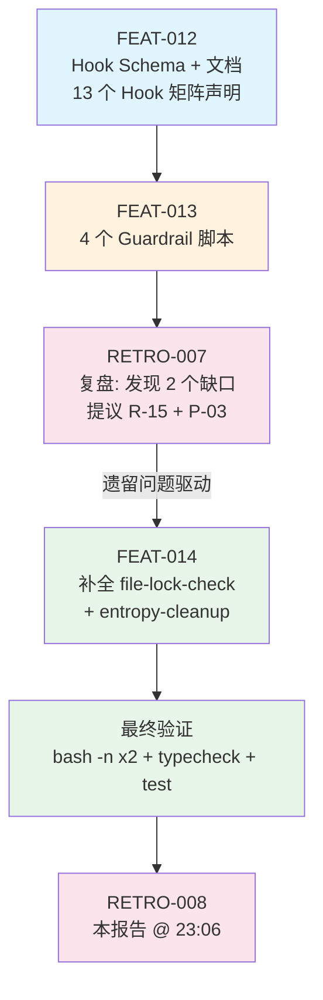

# 复盘报告 — FEAT-014：熵治理 + 文件锁遗留补全

**日期**: 2026-05-11 23:06
**任务目标**: 补全 RETRO-007 遗留的两个 Hook 脚本——`file-lock-check.sh`（pre_task 文件锁检查）和 `entropy-cleanup.sh`（post_task 熵治理清理），并从 contract-mechanism.md 移除 `(未实现)` 标注
**Trace ID**: `feat-014-20260511-entropy-lock`
**执行者**: task-executor (V4 Flash)
**审查者**: code-reviewer (V4 Flash)
**构建者**: N/A（仅 `.opencode/hooks/` 下 Shell 脚本 + `contract-mechanism.md` 文档，无 TypeScript 源码变更，无需构建阶段）
**耗时**: 估算约 5-8 分钟（单合同一次性执行）
**最终状态**: ✅ completed — FEAT-014 完成，`bash -n` 2 脚本语法通过，`bun run typecheck` ✅，`bun run test` ✅ (140/140)，`contract-mechanism.md` 中 `(未实现)` 标注已清零

---

## 执行过程

本任务是 **RETRO-007**（`.opencode/retros/RETRO-2026-05-11-2252-007.md`）提出的遗留问题的直接闭环。RETRO-007 在复盘 FEAT-012 + FEAT-013（Hook 约束系统强化）时发现：contract-mechanism.md 的「Hook 目录」章节声明了 13 个 Hook，但 `.opencode/hooks/` 目录中仅有 11 个 `.sh` 脚本。缺失的 2 个是：

- `file-lock-check.sh` — pre_task 前馈/安全护栏，扫描活跃合同的 files_to_modify 文件重叠
- `entropy-cleanup.sh` — post_task 熵治理/回收，清理临时文件、过期追踪记录、空目录

同时，contract-mechanism.md 中这两处 Hook 带有 `(未实现)` 标注。

### FEAT-014 三阶段变更

| 阶段 | 文件 | 变更类型 | 关键内容 |
|:----:|------|:--------:|---------|
| 1 | `.opencode/hooks/file-lock-check.sh` | **新建** | pre_task 前馈安全护栏，85 行 |
| 2 | `.opencode/hooks/entropy-cleanup.sh` | **新建** | post_task 熵治理回收，69 行 |
| 3 | `.opencode/constraints/contract-mechanism.md` | **修改** | 移除 2 处 `(未实现)` 标注 |

### file-lock-check.sh 技术细节

| 维度 | 实现 |
|------|------|
| **参数** | $1 = 当前合同 JSON 路径 |
| **核心逻辑** | 扫描 `.opencode/contracts/` 下所有 `status=active` 合同（排除自身），逐文件对比 `files_to_modify` |
| **JSON 解析** | jq 优先（精准字段提取），grep+sed 降级（无 jq 环境兼容） |
| **冲突检测** | 发现重叠文件 → `RESULT: BLOCK`（exit 1），列出冲突文件及锁定合同的 task_id + 路径 |
| **无冲突/异常** | 无冲突 → `RESULT: PASS`（exit 0）；无法解析 → `RESULT: WARN`（exit 2） |
| **安全边界** | 跳过自身合同、仅检查 `status=active` 的合同 |
| **设计原理** | Harness Engineering「前馈控制」支柱：在委派 task-executor **之前**阻止文件冲突 |

### entropy-cleanup.sh 技术细节

| 维度 | 实现 |
|------|------|
| **清理项 1** | `.opencode/tmp/` 中超过 1 小时（mmin +60）的临时文件，统计数量和总大小 |
| **清理项 2** | `.opencode/traces/` 中超过 24 小时（mmin +1440）的追踪记录 |
| **清理项 3** | `.opencode/` 下 `tmp` 和 `traces` 子目录中的空目录（保护 `contracts/` 等关键目录） |
| **安全边界** | 仅清理 `.opencode/` 内部目录，不触及项目源码或 `.git/` |
| **输出协议** | 无清理项 → `RESULT: PASS`（exit 0）；有清理 → `RESULT: WARN`（exit 2），附清理数量+大小统计；部分失败 → `RESULT: WARN` 附详细失败列表 |
| **设计原理** | Harness Engineering「熵治理」支柱：对抗 AI Agent 工作流产生的文件熵增 |

### contract-mechanism.md 变更

| 位置 | 变更前 | 变更后 |
|------|--------|--------|
| Pre_task 表 `file-lock-check` 行 | 末尾曾有 `(未实现)` 标注 | 已移除，与其余 hook 格式统一 |
| Post_task 表 `entropy-cleanup` 行 | 末尾曾有 `(未实现)` 标注 | 已移除，与其余 hook 格式统一 |

**验证**: `grep '\(未实现\)' .opencode/constraints/contract-mechanism.md` 返回空 — 确认清零。

### 最终验证

| 验证项 | 命令/方法 | 结果 |
|--------|----------|:----:|
| file-lock-check.sh 语法 | `bash -n .opencode/hooks/file-lock-check.sh` | ✅ PASS |
| entropy-cleanup.sh 语法 | `bash -n .opencode/hooks/entropy-cleanup.sh` | ✅ PASS |
| BLOCK 协议验证 | `grep "BLOCK" .opencode/hooks/file-lock-check.sh` | ✅ 含 RESULT: BLOCK + exit 1 |
| WARN 协议验证 | `grep "WARN" .opencode/hooks/entropy-cleanup.sh` | ✅ 含 RESULT: WARN + exit 2 |
| `(未实现)` 清零 | `grep -r '未实现' .opencode/constraints/contract-mechanism.md` | ✅ 无匹配 |
| TypeScript 类型检查 | `bun run typecheck` | ✅ PASS |
| 单元测试 | `bun run test` | ✅ PASS (140/140) |
| Hook 脚本总数 | `ls .opencode/hooks/*.sh \| wc -l` | ✅ 13/13 |

---

## Harness Engineering 六支柱最终覆盖率

> 本次 FEAT-014 完成前，六支柱中「熵治理」完全缺失（RETRO-007 结论）。
> 本次完成后，**六支柱全部覆盖**，即全支柱闭环。

| 支柱 | 对应 Hook / 机制 | FEAT-014 前 | FEAT-014 后 |
|:----|:----------------|:----------:|:----------:|
| **上下文架构** | contract-schema 可扩展注册 | ✅ | ✅ |
| **架构约束** | arch-constraint-check → BLOCK | ✅ | ✅ |
| **自验证循环** | AGENTS.md BLOCK → crash-doctor 介入 | ✅ | ✅ |
| **前馈控制** | workspace-clean + diff-size-guard + **file-lock-check** | ⚠️ 缺 1 | ✅ |
| **反馈控制** | post-edit-verify + arch-constraint + secret-leak-scan | ✅ | ✅ |
| **熵治理** | **entropy-cleanup** | ❌ | ✅ |

```
熵治理支柱覆盖历程:
  RETRO-007 (22:52) → 发现「完全缺失」→ 提议新增 P-03 约束
  FEAT-014  (23:06) → 实现 entropy-cleanup.sh → 六支柱全部闭环
  RETRO-008 (本报告) → 确认闭环
```

---

## 问题分析

**无问题**。FEAT-014 执行顺利，所有覆盖清单项通过，无构建失败、无运行时崩溃、无验证漏检。

RETRO-007 遗留的 2 个缺口（file-lock-check.sh、entropy-cleanup.sh）已全部补全。

---

## 约束遵守情况

| 约束 | 遵守情况 | 证据 |
|------|:--------:|------|
| R-0: 简体中文 | ✅ | 所有注释、文档使用简体中文 |
| R-6: 完整工作流闭环 | ✅ | FEAT-014 走完 Coordinator → Plan → Task-Executor → Code-Reviewer → Retro |
| R-7: 禁止跳过 Coordinator | ✅ | 通过合同委派，合同落盘 `contracts/20260511/` |
| R-8: 合同必须 | ✅ | 严格在 `files_to_modify` 范围内操作 |
| R-15: Hook 文档实现一致性 | ✅ | **本次正是为满足 R-15**：13 个已声明 hook 全部有 `.sh` 脚本 |
| P-02: 全链路 Trace ID | ✅ | `feat-014-20260511-entropy-lock` |
| P-03: 六支柱覆盖率评估 | ✅ | 本报告完成终评，熵治理由 ❌ → ✅ |
| agent-system | ✅ | task-executor 仅在合同范围内操作 |

---

## 任务合同索引

| task_id | 合同文件 | 目标 | 修改/新建文件 | 状态 |
|:-------:|---------|------|-------------|:----:|
| FEAT-014 | `contracts/20260511/20260511_FEAT_014.json` | 补全 file-lock-check + entropy-cleanup，移除文档标注 | `file-lock-check.sh`, `entropy-cleanup.sh`, `contract-mechanism.md` | ✅ completed |

### 关联上游合同（遗留溯源链）

| 合同 | 关联关系 |
|------|---------|
| FEAT-012 | 前置 — 在 contract-mechanism.md 中声明了 13 个 Hook 矩阵（含 file-lock-check 和 entropy-cleanup 的文档定义） |
| FEAT-013 | 前置 — 实现了 4 个 Guardrail 脚本，但未覆盖缺失的 2 个 |
| RETRO-007 | 复盘 — 发现 file-lock-check 和 entropy-cleanup 缺少脚本实现，提议新增 R-15 + P-03 |
| FEAT-014 | **本次** — 闭环 RETRO-007 遗留，完成最后一个缺口 |

---

## 任务流程

### 流程简图

```
FEAT-012 (Hook Schema + 文档: 声明 13 个 Hook 矩阵)
    │
    └─ FEAT-013 (4 个 Guardrail 脚本实现)
        │
        └─ RETRO-007 (复盘发现: 2 个 Hook 脚本缺失)
            │
            │ 问题 1: file-lock-check.sh 缺失 → Harness「前馈控制」缺 1/3 护栏
            │ 问题 2: entropy-cleanup.sh 缺失 → Harness「熵治理」支柱完全裸露
            │ 约束建议: 新增 R-15 (Hook 文档实现一致性)
            │         新增 P-03 (Harness 六支柱覆盖率评估)
            │
            └─ FEAT-014 (本任务: 熵治理 + 文件锁遗留补全)
                │
                ├─ 新建 file-lock-check.sh (85 行, pre_task)
                ├─ 新建 entropy-cleanup.sh (69 行, post_task)
                └─ 修改 contract-mechanism.md (移除 2 处(未实现)标注)
                    │
                    └─ RETRO-008 (本报告 @ 23:06)
```

### Mermaid 流程图



---

## 经验教训

### 1. 复盘驱动的增量交付模式被验证有效

RETRO-007 通过系统性地对照 Harness Engineering 六支柱评估覆盖率，发现了熵治理支柱的完全缺失和 file-lock-check 的脚本缺口。FEAT-014 作为 RETRO-007 的直接闭环，证明了「复盘 → 发现缺口 → 规划合同 → 执行补全 → 再次复盘验证」的迭代改进循环是有效的。

**关键数据**: 
- RETRO-007 发现: 13 个声明 Hook 中 2 个缺失（15.4% 缺口率）
- FEAT-014 完成后: 13/13 全部实现（0% 缺口率）
- 熵治理支柱: ❌ → ✅

### 2. 「文档先行 + 显式标注」的实践值得推广

contract-mechanism.md 在 FEAT-012 阶段就声明了完整的 13 个 Hook 矩阵（文档先行），对未实现的 hook 使用 `(未实现)` 显式标注。这种模式使得 RETRO-007 可以快速定位缺口，FEAT-014 可以精准补全。R-15 约束正式将此实践固化为 AGENTS.md 规则。

### 3. 双路径兼容设计应成为 Hook 脚本的标准模式

file-lock-check.sh 和 entropy-cleanup.sh 都采用了 jq 优先 + grep/sed 降级的双路径设计，与 FEAT-013 中 diff-size-guard.sh 的设计一脉相承。这种模式确保了在最小化环境（无 jq）中也能正常工作，值得在其余 Hook 脚本中推广。

### 4. 安全边界需要在设计阶段明确

entropy-cleanup.sh 的「仅清理 `.opencode/` 内部目录」的安全边界设计至关重要。任何熵清理脚本如果缺乏边界约束，可能误删源码、配置文件或 `.git/` 目录。本次实现中明确的安全边界包括：
- 仅清理 `tmp/` 和 `traces/` 子目录
- 空目录清理仅限 `tmp` 和 `traces` 模式匹配
- 绝对不触碰 `contracts/`、`hooks/`、`constraints/` 等关键目录

---

## 事故记录

**无事故**。FEAT-014 执行顺利，所有验证项通过，无构建失败、运行时崩溃、验证漏检或约束违反。

RETRO-007 中发现的「文档与实现不一致」问题已在本任务中修复，属于计划性补全，不构成事故。

---

## 约束更新建议

**无需新增/修改约束**。RETRO-007 提议的两项约束（R-15: Hook 文档实现一致性、P-03: Harness 六支柱覆盖率评估）已在上一次复盘后被写入 AGENTS.md。本次 FEAT-014 正是对这两项约束的合规执行：

| 约束 | 状态 | 本次关联 |
|------|:----:|---------|
| R-15: Hook 文档实现一致性 | ✅ 已生效 | FEAT-014 将 13 个 Hook 全部实现，满足「文档声明 = 脚本存在」 |
| P-03: 六支柱覆盖率评估 | ✅ 已生效 | 本复盘报告完成了六支柱终评，熵治理由 ❌ → ✅ |

### UPDATE_VERIFIER（可选，P3）

RETRO-007 曾建议在 `verify_arch.sh` 中新增「Hook 目录完整性检查」，自动对比 contract-mechanism.md 声明的 Hook 与 `.opencode/hooks/` 实际脚本。该建议仍为可选（P3 优先级），未纳入本次强制范围。如后续迭代中 Hook 数量继续增长，建议提升优先级。

---

## 复盘结论

| 维度 | 结论 |
|------|------|
| 合同索引 | 见「任务合同索引」章节 |
| 结论类型 | **NO_ACTION** — 遗留问题已全部闭环，无需新增约束 |
| 复盘报告路径 | `.opencode/retros/RETRO-2026-05-11-2306-008.md` |
| 事故记录 | 无 |
| 约束更新 | 无（R-15 和 P-03 已于 RETRO-007 后生效） |
| 遗留问题 | 无 |
