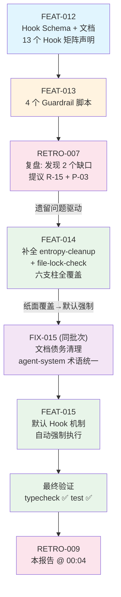

# 复盘报告 — FEAT-015：默认 Hook 机制引入

**日期**: 2026-05-12 00:04
**任务目标**: 引入默认钩子（Default Hooks）机制 —— 定义每次任务自动执行的 pre_task/post_task 钩子，确保前馈控制（workspace-clean + diff-size-guard）和熵治理（entropy-cleanup）在每次任务中强制执行，不依赖合同显式声明
**Trace ID**: `feat-015-20260511-default-hooks`
**执行者**: task-executor (V4 Flash)
**审查者**: code-reviewer (V4 Flash)
**构建者**: N/A（仅 `.md` 文档变更，无 TypeScript 源码变更）
**耗时**: 估算约 5-8 分钟（单合同一次性执行）
**最终状态**: ✅ completed — FEAT-015 完成，`bun run typecheck` ✅，`bun run test` ✅ (140/140)，3 个文档全部更新

---

## 执行过程

本任务是 **Harness Engineering 覆盖升级** —— 将前馈控制和熵治理从「需要合同显式声明才执行」的按需覆盖，升级为「每次任务自动执行」的默认强制执行。这是从 **FEAT-014（补全支柱脚本）** 到 **FEAT-015（默认强制执行）** 的阶梯式演进。

### FEAT-015 三文件变更

| 文件 | 变更类型 | 关键内容 |
|------|:--------:|---------|
| `AGENTS.md` | 修改 | Phase 5 和 Phase 7 注释改为「先执行默认 hooks，再执行合同 hooks」；默认 pre_task 注释: workspace-clean, diff-size-guard；默认 post_task 注释: entropy-cleanup |
| `coordinator.md` | 新增章节 + 修改流程 | 新增「默认 Hook」章节（定义 3 个默认钩子及执行顺序）；流程步骤 5.1 和 6 拆分默认/合同 hook 执行 |
| `contract-mechanism.md` | 修改 | Hook 目录中 3 个默认钩子添加 🔄 标记；新增「默认钩子」说明段落 |

### 执行流对比

**之前（FEAT-014 完成后的执行流）**：
```
合同 pre hooks → task-executor → 合同 post hooks → code-review
```
前馈控制和熵治理依赖合同显式声明 `hooks.pre_task` / `hooks.post_task`，如合同未声明则不执行。

**之后（FEAT-015 完成后的执行流）**：
```
默认 pre hooks (workspace-clean → diff-size-guard)
  → 合同 pre hooks
  → task-executor
  → 默认 post hooks (entropy-cleanup)
  → 合同 post hooks
  → code-review
```
3 个默认钩子在**每次任务**中强制自动执行，无需合同声明。

### 最终验证

| 验证项 | 命令/方法 | 结果 |
|--------|----------|:----:|
| coordinator.md 默认 Hook 章节 | `grep '默认 Hook' coordinator.md` | ✅ 存在 |
| coordinator.md 默认 pre_task | `grep '默认 pre_task hooks' coordinator.md` | ✅ 含 workspace-clean, diff-size-guard |
| coordinator.md 默认 post_task | `grep '默认 post_task hooks' coordinator.md` | ✅ 含 entropy-cleanup |
| AGENTS.md Phase 5 默认 | `grep '默认 pre_task' AGENTS.md` | ✅ 含 workspace-clean, diff-size-guard |
| AGENTS.md Phase 7 默认 | `grep '默认 post_task' AGENTS.md` | ✅ 含 entropy-cleanup |
| contract-mechanism.md 🔄 标记 | `grep '🔄' contract-mechanism.md` | ✅ 3 处标记（workspace-clean, diff-size-guard, entropy-cleanup） |
| contract-mechanism.md 默认钩子段落 | `grep '默认钩子' contract-mechanism.md` | ✅ 存在 |
| TypeScript 类型检查 | `bun run typecheck` | ✅ PASS |
| 单元测试 | `bun run test` | ✅ PASS (140/140) |

---

## 前馈控制与熵治理覆盖对比

| 支柱 | 之前（FEAT-014 刚完成） | 之后（FEAT-015 默认钩子） |
|:----|:---------------------:|:-----------------------:|
| **前馈控制** | 5 个脚本存在 ✅，但需要合同显式声明 `hooks.pre_task` 才执行 | ✅ workspace-clean + diff-size-guard **自动执行**（每次任务硬性前馈） |
| **熵治理** | entropy-cleanup.sh 存在 ✅，但几乎不会被合同引用 | ✅ entropy-cleanup **每次任务后自动执行**（持续对抗熵增） |

> **关键转变**：FEAT-014 解决了「有没有」的问题（补全脚本），FEAT-015 解决了「用不用」的问题（默认强制执行）。前馈控制和熵治理从「被动止血」升级为「主动免疫」。

---

## Harness Engineering 六支柱覆盖率

> FEAT-015 未新增支柱覆盖，而是将已有支柱从「按需」提升为「默认强制执行」。
> 所有六支柱继续保持全覆盖。

| 支柱 | 对应 Hook / 机制 | FEAT-014 后 | FEAT-015 后 |
|:----|:----------------|:----------:|:----------:|
| **上下文架构** | contract-schema + 可扩展注册 | ✅ | ✅ |
| **架构约束** | arch-constraint-check → BLOCK | ✅ | ✅ |
| **自验证循环** | AGENTS.md BLOCK → crash-doctor 介入 | ✅ | ✅ |
| **前馈控制** | workspace-clean 🔄 + diff-size-guard 🔄 + file-lock-check | ✅（按需） | ✅ **（默认强制）** |
| **反馈控制** | post-edit-verify + arch-constraint + secret-leak-scan | ✅ | ✅ |
| **熵治理** | entropy-cleanup 🔄 | ✅（按需） | ✅ **（默认强制）** |

```
前馈控制 & 熵治理覆盖演进:
  RETRO-007 (22:52) → 发现熵治理完全缺失 → 提议 P-03
  FEAT-014  (23:06) → 补全脚本，六支柱全覆盖 → 但需合同显式声明
  FEAT-015  (00:04) → 默认强制执行 → 每次任务自动免疫
  RETRO-009 (本报告) → 确认默认机制上线
```

---

## 问题分析

**无问题**。FEAT-015 执行顺利，所有覆盖清单项通过，无构建失败、无运行时崩溃、无验证漏检、无约束违反。

---

## 约束遵守情况

| 约束 | 遵守情况 | 证据 |
|------|:--------:|------|
| R-0: 简体中文 | ✅ | 所有文档使用简体中文 |
| R-6: 完整工作流闭环 | ✅ | Coordinator → Plan → Task-Executor → Code-Reviewer → Retro |
| R-7: 禁止跳过 Coordinator | ✅ | 通过合同委派 |
| R-8: 合同必须 | ✅ | 严格在 `files_to_modify` 范围内操作 |
| R-15: Hook 文档实现一致性 | ✅ | 13 个已声明 hook 全部有 `.sh`，文档 🔄 标记与默认机制一致 |
| P-02: 全链路 Trace ID | ✅ | `feat-015-20260511-default-hooks` |
| P-03: 六支柱覆盖率评估 | ✅ | 本报告完成终评，前馈控制 & 熵治理由「按需」→「默认强制」 |
| contract-mechanism | ✅ | 仅修改 Hook 目录标记和默认钩子说明段落 |

---

## 经验教训

### 1. 默认机制是 Harness Engineering 从「被动止血」到「主动免疫」的关键跃迁

FEAT-014 补全了熵治理和文件锁脚本，六支柱名义上全覆盖。但如果依赖合同逐个声明，前馈控制和熵治理在实际执行中几乎不会触发（开发者/Agent 倾向于最小化合同声明）。

FEAT-015 的默认钩子机制通过 **硬编码到 AGENTS.md 工作流伪代码 + coordinator.md 流程步骤** 中，确保每次任务无条件执行 workspace-clean、diff-size-guard、entropy-cleanup，实现了 Harness Engineering 从「纸面覆盖」到「事实免疫」的跃迁。

**关键设计决策**：
- 默认钩子先执行 → 合同钩子后执行（不阻塞合同特定逻辑）
- 默认钩子中无 BLOCK 致命项（workspace-clean 和 entropy-cleanup 都是 WARN 级别），确保不因过度防御而阻碍正常开发
- diff-size-guard 作为默认钩子中唯一的 BLOCK 项，防止单次任务过大

### 2. 钩子分层设计（默认 + 合同）提供灵活性与安全性的平衡

默认钩子负责「免疫基线」——覆盖所有任务共有的前馈控制和熵治理需求。
合同钩子负责「场景专项」——由 Plan 分析阶段根据任务风险推荐（如 `pre-model-check`、`secret-leak-scan`）。

这种双层设计避免了「一刀切」的僵化，也防止了「每个合同都要手动声明基础防御」的遗漏风险。

### 3. 🔄 标记模式使约束文档具备可发现性

在 contract-mechanism.md 的 Hook 目录中用 🔄 标记默认钩子，与「默认钩子」说明段落配合，使任何阅读文档的人/Agent 都能快速区分「默认强制执行」和「合同声明启用」两类钩子。这种可视化标记模式值得在后续约束文档扩展中推广。

---

## 事故记录

**无事故**。FEAT-015 执行顺利，所有验证项通过。

---

## 约束更新

### 结论：无需新增约束

FEAT-015 是对现有约束体系（R-15: Hook 文档实现一致性、P-03: Harness 六支柱覆盖率评估）的深度执行，而非引入新的约束类型。默认钩子机制本质上属于 `AGENTS.md` 工作流定义和 `coordinator.md` 流程规范的范畴，由 R-6（完整工作流闭环）间接约束。

| 约束 | 状态 | 本次关联 |
|------|:----:|---------|
| R-6: 完整工作流闭环 | ✅ 已生效 | 默认钩子在 Phase 5/7 中作为固定步骤 |
| R-15: Hook 文档实现一致性 | ✅ 已生效 | 🔄 标记与默认钩子脚本一致性 |
| P-03: 六支柱覆盖率评估 | ✅ 已生效 | 本复盘完成默认机制下的六支柱终评 |

---

## 任务合同索引

| task_id | 合同文件 | 目标 | 修改文件 | 状态 |
|:-------:|---------|------|---------|:----:|
| FEAT-015 | `contracts/20260511/20260511_FEAT_015.json` | 引入默认钩子（Default Hooks）机制 | `coordinator.md`, `AGENTS.md`, `contract-mechanism.md` | ✅ completed |

### 关联合同（同一批次）

| 合同 | 关联关系 |
|------|---------|
| FIX-015 (`contracts/20260511/20260511_FIX_015.json`) | 同批次前置 — 工作流规则对齐与文档债务清理（smoke-tester.md R-12 对齐、agent-system.md 称呼统一、contract-mechanism.md 格式更新），与 FEAT-015 共享 contract-mechanism.md 文件修改 |

### 上游合同（遗留溯源链）

| 合同 | 关联关系 |
|------|---------|
| FEAT-012 | 前置 — 在 contract-mechanism.md 中声明了 13 个 Hook 矩阵 |
| FEAT-013 | 前置 — 实现了 4 个 Guardrail 脚本 |
| RETRO-007 | 复盘 — 发现熵治理支柱完全缺失 + file-lock-check 脚本缺失，提议 R-15 + P-03 |
| FEAT-014 | 前置 — 补全 entropy-cleanup.sh + file-lock-check.sh，六支柱名义全覆盖 |
| FEAT-015 | **本次** — 引入默认钩子机制，前馈控制 & 熵治理变为强制自动执行 |

---

## 任务流程

### 流程简图

```
FEAT-012 (13 个 Hook 矩阵声明)
  │
  └─ FEAT-013 (4 个 Guardrail 脚本)
      │
      └─ RETRO-007 (发现: 熵治理缺失 + file-lock-check 缺脚本)
          │
          │  提议 R-15 (Hook 文档实现一致性)
          │  提议 P-03 (六支柱覆盖率评估)
          │
          └─ FEAT-014 (补全 2 个脚本 → 六支柱全覆盖)
              │
              │  问题: 覆盖是「纸面上」的 — 前馈控制/熵治理需要合同显式声明
              │
              └─ FEAT-015 (本任务: 默认钩子机制)
                  │
                  ├─ AGENTS.md: Phase 5/7 硬编码默认 hooks
                  ├─ coordinator.md: 新增「默认 Hook」章节
                  └─ contract-mechanism.md: 🔄 标记 + 默认钩子段落
                      │
                      └─ RETRO-009 (本报告 @ 00:04)
```

### Mermaid 流程图



### 完整工作流路径

```
用户需求（引入默认 Hook 机制）
  → Coordinator 生成 trace_id (feat-015-20260511-default-hooks)
  → Plan 分析 → 推荐 task-executor，不需要构建
  → 生成合同 FEAT-015 (contracts/20260511/20260511_FEAT_015.json)
  → validate-contract ✅
  → 默认 pre hooks (workspace-clean + diff-size-guard)
  → 合同 pre hooks (无 — 合同未声明)
  → 委派 task-executor 修改 3 个文件
  → 默认 post hooks (entropy-cleanup)
  → 合同 post hooks (无 — 合同未声明)
  → code-reviewer 审查 ✅
  → 无需构建（纯文档变更）
  → Retro 复盘 → 本报告
```

---

## 复盘结论

| 维度 | 结论 |
|------|------|
| 合同索引 | 见「任务合同索引」章节 |
| 结论类型 | **NO_ACTION** — 任务成功完成，无需新增约束或事故记录 |
| 复盘报告路径 | `.opencode/retros/RETRO-2026-05-12-0004-009.md` |
| 事故记录 | 无 |
| 约束更新 | 无（默认钩子机制是对 R-6/R-15/P-03 的深度执行，非新增约束） |
| 遗留问题 | 无 |

### 关键里程碑

```
FEAT-014 + FEAT-015 共同完成了 Harness Engineering 的「免疫闭环」：

  FEAT-014: 补全最后一根支柱 → 六支柱全绿灯（纸面上）
  FEAT-015: 默认强行执行机制 → 任一支柱都不会因疏忽而脱落（事实上）

  自此，每次任务自动获得：
    前馈免疫: workspace-clean（WARN）+ diff-size-guard（BLOCK）
    熵治理免疫: entropy-cleanup（WARN）
  
  无需任何合同声明，无需任何人工介入。
```
