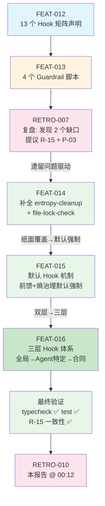

# 复盘报告 — FEAT-016：三层 Hook 体系重构

**日期**: 2026-05-12 00:12
**任务目标**: 重构 Hook 系统为三层结构：1) 全局钩子（所有 Agent 自动执行）；2) Agent 特定钩子（按当前执行 Agent 匹配）；3) 合同钩子（合同声明）。同步引入规则适用范围和事故记录中的 Agent 关联
**Trace ID**: `feat-016-20260512-three-layer-hooks`
**执行者**: task-executor (V4 Flash)
**审查者**: code-reviewer (V4 Flash)
**构建者**: N/A（纯 `.md` 文档变更，无 TypeScript 源码变更）
**耗时**: 估算约 5-8 分钟
**最终状态**: ✅ completed — 三个文件全部更新，`bun run typecheck` ✅，`bun run test` ✅ (140/140)

---

## 执行过程

FEAT-016 是 Hook 架构成熟的**第三阶梯**（FEAT-014 → FEAT-015 → FEAT-016），将 FEAT-015 引入的「默认 + 合同」双层钩子升级为「全局 → Agent 特定 → 合同」三层结构。

### 三层架构演进

```
FEAT-014: 补全脚本 — 六支柱名义全覆盖（entropy-cleanup.sh + file-lock-check.sh）
FEAT-015: 默认钩子   — 前馈/熵治理变为强制自动执行（默认 + 合同双层）
FEAT-016: 三层体系   — 全局 → Agent 特定 → 合同（按 AGENT_ROLE 精确匹配）
```

### 三文件变更

| 文件 | 变更类型 | 关键内容 |
|------|:--------:|---------|
| `coordinator.md` | 重构 | 「默认 Hook」章节重写为「Hook 系统（三层结构）」；新增 Agent → Hook 映射表；流程步骤 5.1/6 改为三层顺序并传入 AGENT_ROLE |
| `AGENTS.md` | 修改 | Phase 5/Phase 7 伪代码改为三层钩子执行 + `agent_role` / `agent_pre` / `agent_post` 参数；R-10/R-12/R-13/P-02 规则增加「适用范围」标注 |
| `contract-mechanism.md` | 修改 | Hook 目录两表均增加「范围」列，区分「全局」和「特定」 |

### 三层结构核心定义

| 层级 | 触发条件 | pre_task | post_task |
|:----:|---------|---------|----------|
| **第一层：全局** | 所有 Agent 自动执行 | `workspace-clean`, `diff-size-guard` | `entropy-cleanup` |
| **第二层：Agent 特定** | 按 `AGENT_ROLE` 匹配 | task-executor → `resource-guard`, `file-lock-check`<br>smoke-tester → `resource-guard`<br>其余 Agent → 无 | task-executor → `post-edit-verify`, `arch-constraint-check`, `secret-leak-scan`<br>其余 Agent → 无 |
| **第三层：合同** | 由合同 `hooks` 字段声明 | 任意 hook（如 `pre-model-check`） | 任意 hook（如 `self-improvement-trigger`） |

### 规则适用范围标注

| 规则 | 适用范围 | 本次新增 |
|:----|:--------:|:------:|
| R-10: Builder 洁净检查 | `builder` | ✅ |
| R-12: Service-Agent 管理 | `coordinator, service-agent` | ✅ |
| R-13: 心跳验证 | `coordinator, heartbeat` | ✅ |
| P-02: 全链路 Trace ID | 所有 Agent（全局） | ✅ |

### 覆盖清单逐项验证

| 覆盖清单项 | 验证方法 | 结果 |
|-----------|---------|:----:|
| `coord_hook_system` | coordinator.md 含「Hook 系统（三层结构）」章节（L51-97） | ✅ |
| `coord_agent_hook_map` | coordinator.md 含 Agent → 特定钩子映射表（L71-81），覆盖全部 9 个 Agent | ✅ |
| `coord_flow_3layer` | coordinator.md 步骤 5.1（L18-30）/6（L34-41）体现全局→Agent 特定→合同三层顺序 | ✅ |
| `agents_pseudo_3layer` | AGENTS.md Phase 5（L89-101）/Phase 7（L122-133）伪代码含 `agent_role`、`global_pre`/`agent_pre`/`global_post`/`agent_post` 三层参数 | ✅ |
| `agents_rule_scope` | AGENTS.md R-10（L268）/R-12（L277）/R-13（L282）/P-02（L293）均标注「适用范围」 | ✅ |
| `contract_md_scope` | contract-mechanism.md pre_task 表（L121-127）/post_task 表（L131-140）均含「范围」列 | ✅ |

### 最终验证

| 验证项 | 命令/方法 | 结果 |
|--------|----------|:----:|
| TypeScript 类型检查 | `bun run typecheck` | ✅ PASS |
| 单元测试 | `bun run test` | ✅ PASS (140/140) |
| R-15 Hook 脚本一致性 | 13 个声明 hook vs 13 个 `.sh` 文件比对 | ✅ PASS |
| 三层结构文档存在 | `grep '三层结构' coordinator.md AGENTS.md` | ✅ 两文件均有 |
| 范围列存在 | `grep '范围' contract-mechanism.md` | ✅ 存在 |

---

## 问题分析

**无问题**。FEAT-016 执行顺利，覆盖清单 6 项全部通过，无构建失败、无运行时崩溃、无验证漏检、无约束违反。

---

## Harness Engineering 六支柱覆盖率

> FEAT-016 在 FEAT-015 的「默认强制执行」基础上，新增了「Agent 特定匹配」粒度控制。
> 六支柱继续保持全覆盖，且前馈控制和反馈控制的钩子触发粒度更加精准。

| 支柱 | 对应 Hook / 机制 | FEAT-015 后 | FEAT-016 后 |
|:----|:----------------|:----------:|:----------:|
| **上下文架构** | contract-schema + 三层结构定义 + AGENT_ROLE 映射 | ✅ | ✅ **（角色感知）** |
| **架构约束** | arch-constraint-check → BLOCK | ✅（默认/合同执行） | ✅ **（仅 task-executor 触发）** |
| **自验证循环** | AGENTS.md BLOCK → crash-doctor 介入 | ✅ | ✅ |
| **前馈控制** | workspace-clean 🔄 全局 + diff-size-guard 🔄 全局 + resource-guard + file-lock-check | ✅（默认 + 合同） | ✅ **（全局强制 + Agent 精准匹配）** |
| **反馈控制** | post-edit-verify + arch-constraint + secret-leak-scan | ✅（默认 + 合同） | ✅ **（仅 task-executor 触发）** |
| **熵治理** | entropy-cleanup 🔄 全局 | ✅（默认强制） | ✅ **（全局强制）** |

```
覆盖粒度演进:
  FEAT-014 (23:06) → 脚本补全，六支柱全覆盖 → 但依赖合同声明
  FEAT-015 (00:04) → 默认强制，前馈+熵治理自动执行 → 两个粒度（默认/合同）
  FEAT-016 (00:12) → 三层体系，按 Agent 角色精确匹配 → 三个粒度（全局/Agent/合同）
  RETRO-010 (本报告) → 确认三层 Hook 体系上线
```

### 粒度价值分析

FEAT-016 的核心改进在于**精准匹配**而非无差别执行：

- **task-executor**（代码修改者）：获得最全面的保护 — pre 含 resource-guard + file-lock-check，post 含 post-edit-verify + arch-constraint-check + secret-leak-scan
- **smoke-tester**（测试者）：仅需资源防护 — pre 含 resource-guard
- **其它 7 个 Agent**（plan、builder、code-reviewer、crash-doctor、retro、service-agent、heartbeat）：不触发任何 Agent 特定钩子，避免不必要的开销和误报

这种设计避免了 FEAT-015 中「所有 Agent 执行所有默认钩子」的潜在问题（如 retro 复盘时触发 secret-leak-scan 毫无意义）。

---

## 约束遵守情况

| 约束 | 遵守情况 | 证据 |
|------|:--------:|------|
| R-0: 简体中文 | ✅ | 所有文档使用简体中文 |
| R-6: 完整工作流闭环 | ✅ | Coordinator → Plan → Task-Executor → Code-Reviewer → Retro |
| R-7: 禁止跳过 Coordinator | ✅ | 通过合同委派 |
| R-8: 合同必须 | ✅ | 严格在 `files_to_modify` 范围内操作 |
| R-15: Hook 文档实现一致性 | ✅ | 13 个声明 hook 全部有 `.sh` 脚本（验证通过） |
| P-02: 全链路 Trace ID | ✅ | `feat-016-20260512-three-layer-hooks` |
| P-03: 六支柱覆盖率评估 | ✅ | 本报告完成三层体系下六支柱终评 |

---

## 经验教训

### 1. 钩子粒度精细化是 Harness Engineering 成熟的标志

FEAT-014（补脚本）→ FEAT-015（默认强制）→ FEAT-016（三层粒度）体现了防御体系从「有没有 → 用不用 → 给谁用」的三段式成熟过程。不是所有 Agent 都需要所有 Hook — plan 做分析不需要代码审查，retro 做复盘不需要资源防护。

**关键设计决策**：
- 全局钩子覆盖**熵相关的共性需求**（workspace-clean、diff-size-guard、entropy-cleanup）
- Agent 特定钩子覆盖**职责相关的专项检查**（task-executor 需代码审查，smoke-tester 需资源防护）
- 合同钩子留作**场景特化的扩展点**（如 pre-model-check、self-improvement-trigger）

### 2. AGENT_ROLE 是实现 Agent 感知钩子的关键机制

通过在 Coordinator 委派前设置 `AGENT_ROLE` 环境变量，Hook 脚本可以判断当前上下文从而决定是否执行特定逻辑。这种「运行时角色注入」模式避免了在 Coordinator 中硬编码所有 Agent 的钩子组合，为未来新增 Agent 类型提供了可扩展性。

### 3. 规则适用范围标注提升可读性与可审计性

在 AGENTS.md 中为 R-10、R-12、R-13、P-02 增加「适用范围」标注，使得：
- **人类开发者** 可以快速判断某规则是否影响自己的操作
- **Agent** 可以在执行前自我检查是否受该规则约束
- **审计工具** 可以自动提取「某 Agent 受哪些规则约束」的映射关系

这种标注模式值得在所有规则中推广。

---

## 事故记录

**无事故**。FEAT-016 执行顺利，所有验证项通过。

---

## 约束更新

### 结论：无需新增约束

FEAT-016 是对现有约束体系（R-15、P-03）和架构（coordinator.md 流程、AGENTS.md 伪代码、contract-mechanism.md 目录）的精细化升级。三层 Hook 体系属于执行架构的成熟化，而非引入新约束类型。

| 约束 | 状态 | 本次关联 |
|------|:----:|---------|
| R-6: 完整工作流闭环 | ✅ 已生效 | 三层钩子在 Phase 5/7 中按顺序执行 |
| R-15: Hook 文档实现一致性 | ✅ 已生效 | 13 个 hook 全部有 `.sh`，范围列与三层定义一致 |
| P-02: 全链路 Trace ID | ✅ 已生效 | 适用范围标注为「所有 Agent（全局）」 |
| P-03: 六支柱覆盖率评估 | ✅ 已生效 | 本复盘完成三层体系下六支柱终评 |

---

## 任务合同索引

| task_id | 合同文件 | 目标 | 修改文件 | 状态 |
|:-------:|---------|------|---------|:----:|
| FEAT-016 | `contracts/20260511/20260511_FEAT_016.json` | 三层 Hook 体系重构 | `coordinator.md`, `AGENTS.md`, `contract-mechanism.md` | ✅ completed |

### 关联合同（同一批次/上游链）

| 合同 | 关联关系 |
|------|---------|
| FEAT-014 (`contracts/20260511/20260511_FEAT_014.json`) | 上游 — 补全 entropy-cleanup.sh + file-lock-check.sh |
| FEAT-015 (`contracts/20260511/20260511_FEAT_015.json`) | 上游 — 引入默认钩子（Default Hooks）机制 |
| **FEAT-016** | **本次** — 三层 Hook 体系重构（全局 → Agent 特定 → 合同） |
| RETRO-009 (`.opencode/retros/RETRO-2026-05-12-0004-009.md`) | 上游复盘 — 确认默认钩子机制上线 |

### 上游溯源链

| 合同 | 关联关系 |
|------|---------|
| FEAT-012 | 前置 — 13 个 Hook 矩阵声明 |
| FEAT-013 | 前置 — 4 个 Guardrail 脚本 |
| RETRO-007 | 复盘 — 发现熵治理缺失 + file-lock-check 缺脚本，提议 R-15 + P-03 |
| FEAT-014 | 前置 — 补全 2 个脚本，六支柱全覆盖 |
| FIX-015 | 同批次 — 文档债务清理 |
| FEAT-015 | 前置 — 默认 Hook 机制 |
| **FEAT-016** | **本次** — 三层体系 |

---

## 任务流程

### 流程简图

```
FEAT-012 (13 个 Hook 矩阵声明)
  └─ FEAT-013 (4 个 Guardrail 脚本)
      └─ RETRO-007 (发现: 熵治理缺失 + file-lock-check 缺脚本)
          │  提议 R-15 (Hook 文档实现一致性)
          │  提议 P-03 (六支柱覆盖率评估)
          │
          └─ FEAT-014 (补全 2 个脚本 → 六支柱全覆盖)
              └─ FEAT-015 (默认 Hook 机制 → 前馈+熵治理默认强制)
                  └─ FEAT-016 (本任务: 三层 Hook 体系)
                      │
                      ├─ coordinator.md: Hook 系统（三层结构）+ Agent 映射表
                      ├─ AGENTS.md:     Phase 5/7 三层伪代码 + 规则适用范围标注
                      └─ contract-mechanism.md: Hook 目录增加「范围」列
                          │
                          └─ RETRO-010 (本报告 @ 00:12)
```

### Mermaid 流程图



### 完整工作流路径

```
用户需求（三层 Hook 体系重构）
  → Coordinator 生成 trace_id (feat-016-20260512-three-layer-hooks)
  → Plan 分析 → 推荐 task-executor，不需要构建
  → 生成合同 FEAT-016 (contracts/20260511/20260511_FEAT_016.json)
  → validate-contract ✅
  → 全局 pre hooks (workspace-clean → diff-size-guard)
  → Agent 特定 pre hooks (task-executor → resource-guard, file-lock-check)
  → 合同 pre hooks (无 — 合同未声明)
  → 委派 task-executor 修改 3 个文件
  → 全局 post hooks (entropy-cleanup)
  → Agent 特定 post hooks (task-executor → post-edit-verify, arch-constraint-check, secret-leak-scan)
  → 合同 post hooks (无 — 合同未声明)
  → code-reviewer 审查 ✅
  → 无需构建（纯文档变更）
  → Retro 复盘 → 本报告
```
