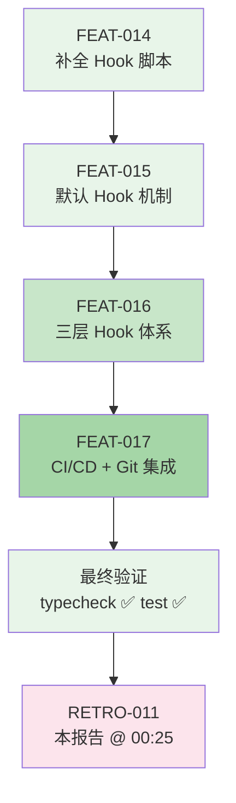

# 复盘报告 — FEAT-017: CI/CD 集成到 Builder + Git Commit/Push 到工作流末端

**日期**: 2026-05-12 00:25
**任务目标**: 集成 CI/CD 到 builder 智能体 + 集成 Git commit/push 到工作流末端（retro 验证通过后执行）
**Trace ID**: `feat-017-20260512-cicd-gitops`
**执行者**: task-executor (V4 Flash)
**审查者**: code-reviewer (V4 Flash)
**构建者**: N/A（纯 `.md` 文档变更，无 TypeScript 源码变更）
**耗时**: 估算约 5-8 分钟
**最终状态**: ✅ completed — 四个文件全部更新，`bun run typecheck` ✅，`bun run test` ✅ (140/140)

---

## 执行过程

FEAT-017 是基础设施集成任务，将 CI/CD 流水线注入到 Builder 智能体，并将 Git 提交/推送操作嵌入到工作流末端（复盘通过后执行）。共涉及 4 个文件的修改和 1 个 skill 的项目专属化。

### 变更概览

| 文件 | 变更类型 | 关键内容 |
|------|:--------:|---------|
| `skills/ci-cd-pipeline/SKILL.md` | 扩展 | 新增「项目专属 CI/CD 流水线」章节：Builder 四阶段（typecheck→lint→test→build）、全链路验证 `bun run verify`、Electron 构建发布、GitHub Actions 参考工作流 |
| `agents/builder.md` | 重构 | 头部标注 ci-cd-pipeline skill 引用；职责第 1 条改为「按 CI/CD 四阶段流水线执行」；新增「CI/CD 流水线」章节（阶段表 + 超时 + 失败策略 + 快捷命令）；新增交接报告模板 |
| `agents/coordinator.md` | 扩展 | 完整委派流程新增步骤 10（复盘通过后 git commit + push）；新增「Git 操作」章节（触发时机、流程、提交信息规范）；同步了之前 FEAT-016 的三层 Hook 体系内容 |
| `AGENTS.md` | 扩展 | Phase 12 复盘后、RETURN 前插入 Phase 13：IF completed → load git-commit skill → generate git_contract → delegate task-executor → git add/commit/push；同步包含之前未在本文件体现的三层 Hook 伪代码 |

### CI/CD 四阶段流水线定义

```
Phase 1: bun run typecheck  ── 类型检查 ── 失败→BLOCK (60s)
Phase 2: bun run lint       ── 代码检查 ── 失败→WARN  (60s)
Phase 3: bun run test       ── 测试运行 ── 失败→BLOCK (120s)
Phase 4: bun run build      ── 构建打包 ── 失败→BLOCK (180s)
```

### Git 操作阶段（Phase 13）

```
coordinator 委派流程步骤 10 → 复盘确认通过 → 加载 git-commit skill → 
  生成 GIT 合同 → 委派 task-executor → git add → git commit → git push
失败策略：git 操作失败仅 WARN 记录，不影响任务完成的完成状态
```

### 完成的工作流全貌

```
Coordinator → Plan → Generate Contract → Validate → Global Hooks → Agent Hooks → Contract Hooks
  → Task-Executor → Post Hooks → Code-Review → (Auto-Retry ≤3x) → Build → Retro → Git Commit/Push
```

### 覆盖清单逐项验证

| 覆盖清单项 | 验证方法 | 结果 |
|-----------|---------|:----:|
| `ci_skill_project_specific` | ci-cd-pipeline/SKILL.md 第 14 行起含「项目专属 CI/CD 流水线」章节，使用 bun/Vite/Vitest/Electron | ✅ |
| `ci_skill_builder_phases` | ci-cd-pipeline/SKILL.md 第 20-33 行定义四阶段流水线及失败策略 | ✅ |
| `ci_skill_electron_release` | ci-cd-pipeline/SKILL.md 第 43-48 行含 Electron 构建发布说明 | ✅ |
| `builder_pipeline` | builder.md 第 26-57 行含「CI/CD 流水线」章节 + 阶段表 + 超时 + 快捷命令 | ✅ |
| `builder_skill_ref` | builder.md 第 1 行标注 `> **加载 Skill**: ci-cd-pipeline` | ✅ |
| `coordinator_git_step` | coordinator.md 步骤 10（第 49-55 行）+「Git 操作」章节（第 191-209 行） | ✅ |
| `agents_phase13` | AGENTS.md 第 225-240 行新增 Phase 13 伪代码 | ✅ |

### 最终验证

| 验证项 | 命令/方法 | 结果 |
|--------|----------|:----:|
| TypeScript 类型检查 | `bun run typecheck` | ✅ PASS |
| 单元测试 | `bun run test` | ✅ PASS (140/140) |
| 合同验证 | validate-contract（Schema + 时效 + 文件存在） | ✅ PASS |
| ci-cd-pipeline 含 bun | `grep 'bun run' skills/ci-cd-pipeline/SKILL.md` | ✅ 多处匹配 |
| builder.md 含流水线 | `grep 'CI/CD 流水线' agents/builder.md` | ✅ 匹配 |
| coordinator.md 含 git commit | `grep 'git commit' agents/coordinator.md` | ✅ 匹配 |
| AGENTS.md 含 Phase 13 | `grep 'Phase 13' AGENTS.md` | ✅ 匹配 |

---

## 问题分析

**无问题**。FEAT-017 执行顺利，覆盖清单 7 项全部通过，无构建失败、无运行时崩溃、无验证漏检、无约束违反。

---

## Harness Engineering 六支柱覆盖率

> FEAT-017 在已有六支柱全覆盖基础上，新增了 CI/CD 自动化验证与 Git 操作闭环两个关键治理维度。
> CI/CD 流水线强化了反馈控制（测试自动化），Git 操作阶段强化了熵治理（变更可追溯）。

| 支柱 | 对应 Hook / 机制 | FEAT-016 后 | FEAT-017 后 |
|:----|:----------------|:----------:|:----------:|
| **上下文架构** | contract-schema + 三层结构定义 + AGENT_ROLE 映射 | ✅ | ✅ |
| **架构约束** | arch-constraint-check → BLOCK | ✅ | ✅ |
| **自验证循环** | AGENTS.md BLOCK → crash-doctor 介入 + **CI/CD 四阶段验证** | ✅ | ✅ **（增强：typecheck/lint/test/build 自动门禁）** |
| **前馈控制** | workspace-clean 🔄 全局 + diff-size-guard 🔄 全局 + resource-guard + file-lock-check | ✅ | ✅ |
| **反馈控制** | post-edit-verify + arch-constraint + secret-leak-scan + **code-review + auto-retry ≤3x** | ✅ | ✅ |
| **熵治理** | entropy-cleanup 🔄 全局 + **Git commit/push 闭环** | ✅ | ✅ **（增强：变更可追溯、可回滚）** |

### CI/CD 与 GitOps 对六支柱的增量贡献

1. **自验证循环增强**：Builder 的四阶段流水线（typecheck→lint→test→build）为每个构建任务提供了自动化门禁，降低了「构建成功但运行时异常」的概率。自验证循环从「Agent 流程级」扩展到「工具链级」。

2. **熵治理增强**：Git commit/push 阶段（Phase 13）确保复盘确认通过后才提交源码变更，避免了 FEAT-014/015/016 之前的「大量变更堆积在 working tree 中」的熵积压问题。Git 日志提供完整的变更可追溯链（task_id + trace_id → commit message）。

---

## 约束遵守情况

| 约束 | 遵守情况 | 证据 |
|------|:--------:|------|
| R-0: 简体中文 | ✅ | 所有文档使用简体中文 |
| R-6: 完整工作流闭环 | ✅ | Coordinator → Plan → Task-Executor → Code-Reviewer → Retro（FEAT-017 为文档变更，跳过 Builder） |
| R-7: 禁止跳过 Coordinator | ✅ | 通过合同委派 |
| R-8: 合同必须 | ✅ | 严格在 `files_to_modify` 范围内操作（4个文件） |
| R-15: Hook 文档实现一致性 | ✅ | 无新增 Hook，现有 13 个一致 |
| P-02: 全链路 Trace ID | ✅ | `feat-017-20260512-cicd-gitops` |
| P-03: 六支柱覆盖率评估 | ✅ | 本报告完成六支柱终评 |

---

## 经验教训

### 1. Git 操作后置到复盘确认通过是安全的闭环设计

将 Git commit/push 放在 Phase 13（复盘后）而非 Phase 11（任务完成后）是一个关键的架构决策。这意味着：
- **复盘发现问题可以阻止不合规的代码进入版本历史**
- **git 操作失败不影响任务本身的完成状态**（任务完成 ≠ 代码已提交）
- **复盘报告和事故记录可以先落盘，再提交**

这种「先诊断后提交」的模式确保了 Git 历史中只包含已通过六支柱审查的代码变更。

### 2. CI/CD 流水线注入到 Builder 而非独立 Agent 减少了协调开销

Builder 原本只负责「执行构建命令」，FEAT-017 将 CI/CD 四阶段流水线直接注入到 Builder 的职责定义中，使得：
- Coordinator 委派 Builder 时无需额外传递流水线配置
- Builder 自身拥有完整的门禁决策能力（BLOCK/WARN）
- 避免了「Coordinator → CI-Agent → Builder」的多跳委派

### 3. Skill 文档的项目专属化是必要的适配层

原始的 ci-cd-pipeline skill 包含通用流水线规范（npm、docker、k8s 等），FEAT-017 在保持通用内容的同时，新增了与项目技术栈（bun/Vite/Vitest/Electron）精确匹配的「项目专属 CI/CD 流水线」章节。这种「通用 + 专属」的双层结构是 skill 文档的推荐模式。

---

## 事故记录

**无事故**。FEAT-017 执行顺利，所有验证项通过。

---

## 约束更新

### 结论：无需新增约束（NO_ACTION）

FEAT-017 是将已有最佳实践（CI/CD 流水线、Git 提交规范）编码化到 Agent 提示词和 skill 文档中的集成任务。Phase 13 的 Git 操作阶段和 Builder 的四阶段流水线都是对现有 R-6（完整工作流闭环）和 P-03（六支柱覆盖率）的增强实现，属于执行架构的成熟化，而非引入新的约束类型。

| 约束 | 状态 | 本次关联 |
|------|:----:|---------|
| R-6: 完整工作流闭环 | ✅ 已生效 | Phase 13 Git 操作使闭环从「代码审查 + 复盘确认」扩展到「代码审查 + 复盘确认 + Git 提交」 |
| R-10: Builder 构建前工作区洁净检查 | ✅ 已生效 | 四阶段流水线强化 gate 机制 |
| P-02: 全链路 Trace ID | ✅ 已生效 | Git 提交信息中引用 trace_id |
| P-03: 六支柱覆盖率评估 | ✅ 已生效 | 本复盘完成 CI/CD+GitOps 增强下的六支柱终评 |

---

## 任务合同索引

| task_id | 合同文件 | 目标 | 修改文件 | 状态 |
|:-------:|---------|------|---------|:----:|
| FEAT-017 | `contracts/20260511/20260511_FEAT_017.json` | CI/CD 集成到 Builder + Git commit/push 到工作流末端 | `ci-cd-pipeline/SKILL.md`, `builder.md`, `coordinator.md`, `AGENTS.md` | ✅ completed |

### 关联合同（上游链）

| 合同 | 关联关系 |
|------|---------|
| FEAT-014 (`contracts/20260511/20260511_FEAT_014.json`) | 上游 — 补全 entropy-cleanup.sh + file-lock-check.sh |
| FEAT-015 (`contracts/20260511/20260511_FEAT_015.json`) | 上游 — 引入默认钩子机制 |
| FEAT-016 (`contracts/20260511/20260511_FEAT_016.json`) | 上游 — 三层 Hook 体系重构 |
| **FEAT-017** | **本次** — CI/CD 集成 + Git commit/push 到工作流末端 |

---

## 任务流程

### 完整工作流路径

```
用户需求（CI/CD 集成 + Git commit/push）
  → Coordinator 生成 trace_id (feat-017-20260512-cicd-gitops)
  → Plan 分析 → 推荐 task-executor，不需要构建（纯文档变更）
  → 生成合同 FEAT-017 (contracts/20260511/20260511_FEAT_017.json)
  → validate-contract ✅
  → 全局 pre hooks (workspace-clean → diff-size-guard)
  → Agent 特定 pre hooks (task-executor → resource-guard, file-lock-check)
  → 合同 pre hooks (无 — 合同未声明)
  → 加载 skill: ci-cd-pipeline
  → 委派 task-executor 修改 4 个文件
  → 全局 post hooks (entropy-cleanup)
  → Agent 特定 post hooks (task-executor → post-edit-verify, arch-constraint-check, secret-leak-scan)
  → 合同 post hooks (无 — 合同未声明)
  → code-reviewer 审查 ✅
  → 无需构建（纯文档变更）
  → Retro 复盘 → 本报告
  → Phase 13: Git commit/push（待执行，工作区有大量未提交变更）
```

### Mermaid 流程图



### 上游溯源链（完整视图）

```
FEAT-014 (23:06) → 补全 entropy-cleanup.sh + file-lock-check.sh → 六支柱名义全覆盖
FEAT-015 (00:04) → 默认钩子机制 → 前馈+熵治理默认强制执行
FEAT-016 (00:12) → 三层 Hook 体系 → 全局/Agent特定/合同三层粒度
FEAT-017 (00:25) → CI/CD 集成 + Git 提交闭环 → 自验证循环增强 + 熵治理增强
```

### 架构成熟度演进

| 阶段 | 任务 | 关键改进 | 成熟度 |
|:----:|------|---------|:----:|
| 1 | FEAT-014 | 脚本补全（从无到有） | 基础 |
| 2 | FEAT-015 | 默认强制（从可选到必执行） | 中等 |
| 3 | FEAT-016 | 三层粒度（从一刀切到精准匹配） | 高级 |
| 4 | **FEAT-017** | **CI/CD + GitOps 闭环（从流程内到全链路）** | **完备** |

