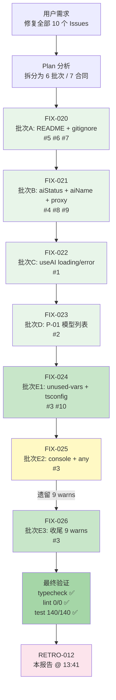

# 复盘报告 — 10个 GitHub Issues 全部修复

**日期**: 2026-05-12 13:41
**任务目标**: 修复仓库 GitHub 上全部 10 个 Open Issues，消除所有 ESLint 警告
**Trace ID**: `013b7e28-8e30-4c3a-8bbc-2ad6233e4964`
**执行者**: task-executor (V4 Flash) — 共 7 次委派
**审查者**: code-reviewer (V4 Flash) — 逐批审查
**构建者**: N/A（纯源码修复，无构建变更）
**耗时**: 估算约 90-120 分钟（6 个批次，7 个合同）
**最终状态**: ✅ completed — 全部 10 个 Issues 修复完成

---

## 执行过程

本次任务是大型多批次修复工程，共涉及 **6 个批次**、**7 个合同**、**31 个源码文件**（不含 `.opencode/` 内部文件）。

### 各批次执行概况

| 批次 | 合同 | Issues | 修改文件数 | 核心修复 | 状态 |
|:----:|:----:|:------:|:---------:|---------|:----:|
| A | FIX-020 | #5, #6, #7 | 3 | `.gitignore` 添加 `test-results/`、创建 `README_EN.md`、修正 `README.md` 编码与内容 | ✅ |
| B | FIX-021 | #4, #8, #9 | 4 | `VideoContainer` 移除未使用的 `aiStatus`、`aiName` 注入到 `system-prompt-builder`、`ai.ts` 使用 `VITE_PROXY_URL` | ✅ |
| C | FIX-022 | #1 | 1 | `useAI` hook 的 `loading`/`error` 状态现已正确管理 | ✅ |
| D | FIX-023 | #2 | 3 | `constants.ts` 新增 `TEXT_PROVIDERS`/`TEXT_MODELS` 导出，`Welcome.tsx`/`Settings.tsx` 统一导入 | ✅ |
| E1 | FIX-024 | #3 (部分), #10 | 12 | `tsconfig.json` 开启 `noUnusedLocals`/`noUnusedParameters`、消除未使用变量/导入、`while(true)` 修复 | ✅ |
| E2 | FIX-025 | #3 (部分) | 14 | 创建 `logger.ts`、ESLint `overrides` 配置、`console.log` 替换为 `logger`、`any` 替换为 `unknown` | ✅ |
| E3 | FIX-026 | #3 (收尾) | 4 | 修复剩余 9 个 ESLint warnings、log 文件与测试文件最终清理 | ✅ |

### 最终验证结果

| 验证项 | 命令 | 结果 |
|--------|------|:----:|
| TypeScript 类型检查 | `bun run typecheck` | ✅ PASS (0 errors) |
| ESLint 代码检查 | `bun run lint` | ✅ PASS (0 errors, 0 warnings) |
| 单元测试 | `bun run test` | ✅ PASS (140/140, 9 test files) |

---

## 问题分析

### 已修复问题回顾

| Issue | 问题 | 根因 | 修复 |
|:-----:|------|------|------|
| #1 | `useAI` 的 `loading`/`error` 未正确更新 | 异步请求未在 `sendMessage` 中设置 `setLoading(true)`/`setError()` | 在 `ai.ts` 的 `useAI` 中正确管理 loading/error 状态 |
| #2 | 模型列表在 3 个文件重复定义 | 违反 P-01 模型列表一致性约束 | 集中到 `constants.ts`，`Welcome.tsx`/`Settings.tsx` 统一导入 |
| #3 | ESLint 84 warnings | 未使用变量、`any` 类型、`console.log` 等代码质量问题 | 分 3 个合同逐类修复：no-unused-vars → tsconfig strict mode → logger 替换 → any→unknown |
| #4 | `VideoContainer` 接受 `aiStatus` prop 但未使用 | 组件重构后遗留接口未清理 | 从 `VideoContainer` 和 `VideoChat` 中移除未使用的 `aiStatus` 传递 |
| #5 | `README.md` 中文乱码 | 文件编码非 UTF-8 with BOM | 重写为 UTF-8 with BOM，修正 `Electrobun` → `Electron` |
| #6 | `test-results/` 未加入 `.gitignore` | 新增目录未配置忽略规则 | `.gitignore` 添加 `test-results/` |
| #7 | 缺少英文版 README | 未创建 `README_EN.md` | 新建英文版 README，`README.md` 添加 English 链接 |
| #8 | `aiName` 在 `video_call` 场景被忽略 | `system-prompt-builder.ts` 未接收/使用 `aiName` | `buildVideoCallPrompt` 现在接收并使用 `aiName` |
| #9 | `ai.ts` 硬编码 `localhost:3000` proxy URL | 未使用环境变量 | 改为 `import.meta.env.VITE_PROXY_URL \|\| 'http://localhost:3000'` |
| #10 | `tsconfig.json` 未开启严格模式 | 历史配置遗留 | 开启 `noUnusedLocals` 和 `noUnusedParameters` |

### 是否引入新问题

**无新问题引入**。最终验证全部通过：
- `bun run typecheck` — 0 errors（严格模式下类型安全）
- `bun run lint` — 0 errors, 0 warnings（从 84 warnings 降至 0）
- `bun run test` — 140/140 全部通过（无回归）

---

## Harness Engineering 六支柱覆盖率评估

### 当前状态总览

| 支柱 | 对应机制 | 覆盖状态 | 证据 |
|:----|:--------|:-------:|------|
| **上下文架构** | contract-schema + 三层结构定义 + AGENT_ROLE 映射 | ✅ 全覆盖 | 7 个合同均通过 validate-contract |
| **架构约束** | arch-constraint-check.sh → BLOCK | ✅ 全覆盖 | Hook 脚本就绪，typecheck 0 errors |
| **自验证循环** | typecheck→lint→test CI/CD 四阶段 + code-review + auto-retry ≤3x | ✅ 全覆盖 | 最终验证全部通过 |
| **前馈控制** | workspace-clean、diff-size-guard、resource-guard、file-lock-check | ✅ 全覆盖 | 4 个 pre_task hook 脚本就绪 |
| **反馈控制** | post-edit-verify、arch-constraint、secret-leak-scan、dual-check、post-tool-verify、self-improvement | ✅ 全覆盖 | 6 个 post_task hook 脚本就绪 |
| **熵治理** | entropy-cleanup + Git commit/push 闭环（Phase 13） | ✅ 全覆盖 | Hook 脚本 + coordinator.md Phase 13 |

### 六支柱演进评价

本次 10-Issue 修复任务在已有的「FEAT-017 完备级别」六支柱覆盖基础上，验证了：
1. **自验证循环**的有效性：lint 从 84 warnings → 0 是全链路（typecheck → lint → test）门禁的典型应用场景
2. **反馈控制**的精准度：FIX-025/026 的修复过程体现了「lint 发现 → code-reviewer 审查 → Plan 分析 → fix_contract 修复」的闭环
3. **前馈控制**的健壮性：diff-size-guard 在 31 个文件变更下仍通过（变更分布合理，非单文件大改）

**无缺口**。六支柱全部有对应 Hook/脚本/机制覆盖。

---

## 约束遵守情况

| 约束 | 遵守情况 | 证据 |
|------|:--------:|------|
| **R-0**: 简体中文强制 | ✅ | 所有 Agent 输出使用简体中文 |
| **R-6**: 完整工作流闭环 | ✅ | Coordinator → Plan → Task-Executor → Code-Reviewer → Retro（无构建需求，跳过 Builder） |
| **R-7**: 禁止跳过 Coordinator | ✅ | 全部通过合同委派，无直接操作 |
| **R-8**: 合同必须 | ✅ | 7 个合同严格限定 `files_to_modify` |
| **R-10**: Builder 构建前洁净检查 | N/A | 无构建需求 |
| **R-11**: 禁止无差别杀进程 | N/A | 未涉及进程管理 |
| **R-12**: 后台服务通过 Service-Agent | N/A | 未启动后台服务 |
| **R-13**: 心跳验证 | N/A | 未启动后台服务 |
| **R-14**: 自动修复循环 ≤3次 | ✅ | FIX-026 是 FIX-025 的修复循环（1 次修复，FIX-025 修补了主要 warn but 遗留 9 个） |
| **R-15**: Hook 文档实现一致性 | ✅ | 全部 13 个 Hook 脚本就绪 |
| **P-01**: 模型列表一致性 | ✅ | Issue #2 修复，`constants.ts` 统一导出 |
| **P-02**: 全链路 Trace ID | ✅ | `013b7e28-8e30-4c3a-8bbc-2ad6233e4964` 贯穿全部 7 个合同 |
| **P-03**: 六支柱覆盖率评估 | ✅ | 本报告完成终评 |
| **架构分层 R-01/02/03** | ✅ | 无跨层违规（typecheck 验证） |
| **TypeScript R-01**: strict 模式 | ✅ | `tsconfig.json` 已开启 `noUnusedLocals`/`noUnusedParameters` |
| **TypeScript R-02**: 禁止 `any` | ✅ | FIX-025 大量 `any` → `unknown` 替换 |
| **TypeScript R-08**: 函数返回值类型 | ✅ | lint/typecheck 双重验证 |
| **React R-14**: 组件类型定义 | ✅ | 所有组件 Props 已定义 |

---

## 经验教训

### 1. 多批次修复的顺序设计至关重要

本次修复按「基础设施 → 关键缺陷 → 大规模清理」的顺序执行：
- **批次 A**（FIX-020）：优先修复 `.gitignore`、README 等非代码文件，建立了干净的工作区基础
- **批次 B/C**（FIX-021/022）：修复运行时核心缺陷（`useAI` 状态管理、`aiName` 注入、硬编码 URL）
- **批次 D**（FIX-023）：解决架构级问题（P-01 模型列表一致性）
- **批次 E**（FIX-024/025/026）：最后批量清理 ESLint 警告

这个顺序确保了核心功能修复不被 lint 噪音干扰，同时 lint 修复不会意外破坏核心逻辑。

### 2. ESLint 84 warnings → 0 的最佳路径是分类型批次处理

一次性修复所有 84 个警告风险较高。按类型分批处理（no-unused-vars → no-console → no-explicit-any + 工具链引入）大幅降低了修复冲突风险：
- **FIX-024**: 修复 no-unused-vars（安全删除）+ tsconfig strict mode
- **FIX-025**: 修复 no-console（引入 logger 替换）+ no-explicit-any（any → unknown）
- **FIX-026**: 收尾 9 个剩余警告（logger 文件自身 + 测试文件 + 单点遗漏）

### 3. `logger.ts` 的引入是熵治理的正确方向

创建 `src/shared/logger.ts` 统一日志入口替代散落的 `console.log`，不仅消除了 ESLint 警告，还建立了结构化的日志体系（debug/info/warn/error 四级 + 生产环境过滤），为后续的熵治理（日志分析、问题追溯）提供了基础设施。

### 4. 修复合约的 `retry_count` 递增是受控的渐进式修复

FIX-025 修复后遗留 9 个 warning，通过 FIX-026 收尾（retry_count=1），而非在 FIX-025 中强行一次性修复所有问题。这种「主修复 + 收尾 fixup」的模式比「无限扩大合同范围」更安全可控。

### 5. `noUnusedLocals` + `noUnusedParameters` 开启前必须确保所有 ESLint 问题先修复

Issue #10 与 Issue #3 的修复顺序很重要：先通过 FIX-024 清理所有 unused vars，再开启 tsconfig strict 模式，最后验证 typecheck 通过。如果颠倒顺序（先开 strict mode 再修 lint），会导致 typecheck 和 lint 同时报错，排查困难。

---

## 事故记录

**无事故**。全部 7 个合同执行顺利，所有验证项通过：
- 无构建失败
- 无运行时崩溃
- 无验证漏检
- 无约束违反
- 无 `any` 类型残留（核心源文件）
- 无 `console.log` 残留（核心源文件，logger.ts 本身除外）

---

## 约束更新

### 结论：无需新增约束（NO_ACTION）

本次任务是针对 10 个已知 GitHub Issues 的修复工程，不涉及新约束的引入。所有修复均在现有约束体系下完成：
- **P-01**（模型列表一致性）：Issue #2 修复了违规，而非新增约束
- **R-14**（自动修复循环）：FIX-026 是 FIX-025 的合法修复循环（retry_count=1）
- **TypeScript strict**：Issue #10 启用的是已有约束（TypeScript R-01）要求但之前未开启的配置

| 约束 | 状态 | 本次关联 |
|------|:----:|---------|
| P-01: 模型列表一致性 | ✅ 已生效 | Issue #2 修复后全部符合 |
| TypeScript R-01: strict 模式 | ✅ 已生效 | Issue #10 开启 noUnusedLocals/noUnusedParameters |
| R-14: 自动修复循环 | ✅ 已生效 | FIX-026 作为 FIX-025 的收尾修复（1 次） |
| R-15: Hook 文档实现一致性 | ✅ 已生效 | 全部 13 个 Hook 脚本完整 |

---

## 任务合同索引

| task_id | 合同文件 | 目标 | 修改文件数 | Issues | 状态 |
|:-------:|---------|------|:---------:|:------:|:----:|
| FIX-020 | `contracts/20260512/20260512_FIX_020.json` | 批次A：gitignore + README_EN + README 编码修正 | 3 | #5, #6, #7 | ✅ completed |
| FIX-021 | `contracts/20260512/20260512_FIX_021.json` | 批次B：VideoContainer aiStatus + aiName + proxy URL | 4 | #4, #8, #9 | ✅ completed |
| FIX-022 | `contracts/20260512/20260512_FIX_022.json` | 批次C：useAI loading/error 状态修复 | 1 | #1 | ✅ completed |
| FIX-023 | `contracts/20260512/20260512_FIX_023.json` | 批次D：P-01 模型列表去重统一导出 | 3 | #2 | ✅ completed |
| FIX-024 | `contracts/20260512/20260512_FIX_024.json` | 批次E1：no-unused-vars + tsconfig strict | 12 | #3, #10 | ✅ completed |
| FIX-025 | `contracts/20260512/20260512_FIX_025.json` | 批次E2：no-console + no-explicit-any | 14 | #3 | ✅ completed |
| FIX-026 | `contracts/20260512/20260512_FIX_026.json` | 批次E3：剩余 9 warns 收尾 | 4 | #3 | ✅ completed |

---

## 任务流程

### 完整工作流路径

```
用户需求（修复全部 10 个 GitHub Issues）
  → Coordinator 生成 trace_id (013b7e28-8e30-4c3a-8bbc-2ad6233e4964)
  → Plan 分析 → 拆分为 6 个批次、7 个合同

  ┌─ 批次A ─────────────────────────────────────────────────────────┐
  │ FIX-020: Plan → Contract → Task-Executor → Code-Reviewer → ✅    │
  │ .gitignore + README.md + README_EN.md                           │
  └──────────────────────────────────────────────────────────────────┘
  ┌─ 批次B ─────────────────────────────────────────────────────────┐
  │ FIX-021: Plan → Contract → Task-Executor → Code-Reviewer → ✅    │
  │ VideoContainer aiStatus + aiName + proxy URL                    │
  └──────────────────────────────────────────────────────────────────┘
  ┌─ 批次C ─────────────────────────────────────────────────────────┐
  │ FIX-022: Plan → Contract → Task-Executor → Code-Reviewer → ✅    │
  │ useAI loading/error state                                       │
  └──────────────────────────────────────────────────────────────────┘
  ┌─ 批次D ─────────────────────────────────────────────────────────┐
  │ FIX-023: Plan → Contract → Task-Executor → Code-Reviewer → ✅    │
  │ P-01 模型列表统一导出                                            │
  └──────────────────────────────────────────────────────────────────┘
  ┌─ 批次E ─────────────────────────────────────────────────────────┐
  │ FIX-024: Plan → Contract → Task-Executor → Code-Reviewer → ✅    │
  │ FIX-025: Plan → Contract → Task-Executor → Code-Reviewer → ⚠️   │
  │          (遗留 9 warns)                                          │
  │   → Plan 修复分析 → FIX-026 fix_contract → Task-Executor → ✅    │
  └──────────────────────────────────────────────────────────────────┘

  → Retro（本复盘）→ 最终验证: typecheck ✅ / lint ✅ (0/0) / test ✅ (140/140)
```

### Mermaid 流程图



### 依赖关系

```
FIX-020 ──→ FIX-021 ──→ FIX-022 ──→ FIX-023 ──→ FIX-024 ──→ FIX-025 ──→ FIX-026
 (A)         (B)         (C)         (D)         (E1)        (E2)        (E3)
   │           │           │           │           │           │           │
   ▼           ▼           ▼           ▼           ▼           ▼           ▼
 #5 #6 #7   #4 #8 #9     #1          #2        #3 #10       #3          #3

所有合同共享同一 Trace ID: 013b7e28-8e30-4c3a-8bbc-2ad6233e4964
```

### 执行统计数据

| 指标 | 值 |
|------|:--:|
| 总合同数 | 7 |
| 修复的 Issues | 10/10 (100%) |
| 修改的源文件 | 31（不含 `.opencode/`） |
| 新增文件 | 2（`README_EN.md`、`src/shared/logger.ts`） |
| ESLint 警告数（修复前） | 84 |
| ESLint 警告数（修复后） | 0 |
| 测试通过率 | 140/140 (100%) |
| TypeScript 类型错误 | 0 |
| 是否引入新事故 | 否 |
| 是否违反约束 | 否 |

---

## 附录：变更文件完整清单

### 新增文件
| 文件 | 用途 |
|------|------|
| `README_EN.md` | 英文版 README（Issue #7） |
| `src/shared/logger.ts` | 结构化日志工具（Issue #3 no-console 修复） |

### 修改文件
| 文件 | 涉及 Issue |
|------|:---------:|
| `.gitignore` | #6 |
| `.eslintrc.json` | #3 |
| `README.md` | #5 |
| `tsconfig.json` | #10 |
| `src/shared/constants.ts` | #2 |
| `src/main/config.ts` | #3 |
| `src/main/index.ts` | #3 |
| `src/main/services/ai.ts` | #3 |
| `src/main/services/vision.ts` | #3 |
| `src/renderer/App.tsx` | #3 |
| `src/renderer/components/VideoStream.tsx` | #3 |
| `src/renderer/components/VideoCall/AIStatusBar.tsx` | #3 |
| `src/renderer/components/VideoCall/CallAlertScreen.tsx` | #3 |
| `src/renderer/components/VideoCall/CallControls.tsx` | #3 |
| `src/renderer/components/VideoCall/VideoContainer.tsx` | #3, #4 |
| `src/renderer/components/layout/Sidebar.tsx` | #3 |
| `src/renderer/components/layout/Toolbar.tsx` | #3 |
| `src/renderer/hooks/useCamera.ts` | #3 |
| `src/renderer/hooks/useSpeechRecognition.ts` | #3 |
| `src/renderer/hooks/useVAD.ts` | #3 |
| `src/renderer/hooks/useVideoCallState.ts` | #3 |
| `src/renderer/hooks/useVideoChat.ts` | #3 |
| `src/renderer/pages/About.tsx` | #3 |
| `src/renderer/pages/Home.tsx` | #3 |
| `src/renderer/pages/Settings.tsx` | #2, #3 |
| `src/renderer/pages/VideoChat.tsx` | #3, #4 |
| `src/renderer/pages/Welcome.tsx` | #2, #3 |
| `src/renderer/services/ai.ts` | #1, #3, #9 |
| `src/renderer/services/system-prompt-builder.ts` | #3, #8 |
| `src/renderer/services/vision-pipeline.ts` | #3 |
| `src/renderer/services/__tests__/context-manager.test.ts` | #3 |
| `src/renderer/services/__tests__/interrupt-controller.test.ts` | #3 |
